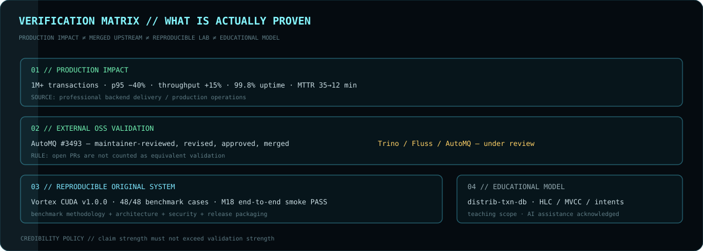
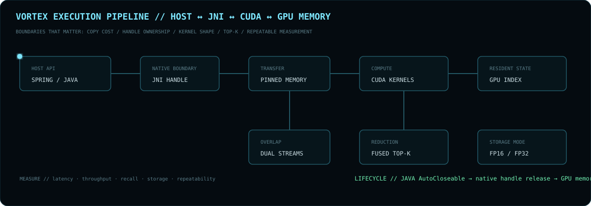
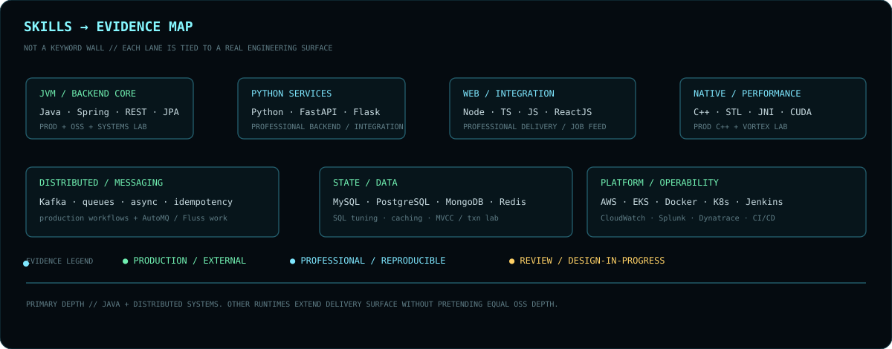

<div align="center">


<br>

**`BACKEND ARCHITECT X // BACKEND & DISTRIBUTED SYSTEMS ENGINEER`**

[GitHub](https://github.com/BackendArchitectX) · [Email](mailto:pranayp.kadu@gmail.com)

<sub>Java-first backend engineering across distributed systems, multi-runtime services, performance and production reliability.</sub>

</div>

---



## `01 // VERIFIED SIGNAL`

### `PRODUCTION`

`1M+ transactions` · `p95 −40%` · `throughput +15%` · `99.8% uptime` · `MTTR 35 → 12 min`

Production work spans Java/Spring Boot, Python/FastAPI/Flask, C++/STL, Kafka, Redis, SQL, AWS/EKS, Kubernetes and observability tooling.

### `OPEN SOURCE`

| SIGNAL | PROBLEM | PROOF | STATUS |
|:--|:--|:--|:--|
| [**AutoMQ #3493**](https://github.com/AutoMQ/automq/pull/3493) | controller-only reporter lifecycle | role/lifecycle regressions + maintainer design review | **MERGED** |
| [**Trino #30973**](https://github.com/trinodb/trino/pull/30973) | commit/failure finalization race | explicit ownership + deterministic blocked-commit tests | **REVIEW** |
| [**Fluss #4263**](https://github.com/apache/fluss/pull/4263) | stale physical endpoint reuse | endpoint identity + two-live-server regression | **REVIEW** |
| [**AutoMQ #3579**](https://github.com/AutoMQ/automq/pull/3579) | Prometheus endpoint authentication | config/policy/lifecycle tests | **REVIEW** |
| [**Fluss #4230**](https://github.com/apache/fluss/pull/4230) | custom Paimon table paths | lake-only + lake/log + predicate coverage | **REVIEW** |

**Credibility rule:** merged upstream ≠ open review. AutoMQ #3493 is the strongest external validation; the remaining PRs are engineering work still being evaluated upstream.

<details>
<summary><code>EXPAND // INVARIANTS BEHIND THE FIXES</code></summary>
<br>

- **Process roles:** runtime lifecycle must follow source-system configuration semantics.
- **Finalization:** once one path owns a terminal transition, unrelated failure cannot steal it.
- **Connection identity:** logical identity must not silently imply physical location.
- **Lifecycle:** creators own threads, permits, connections and native handles unless ownership is transferred.
- **Race testing:** force timing windows deterministically rather than relying on stress-test luck.

</details>

---

## `02 // ORIGINAL SYSTEMS`

### `VORTEX CUDA // REPRODUCIBLE SYSTEM`



[**Repository →**](https://github.com/BackendArchitectX/Vortex-CUDA)

`Spring Boot → Java API → JNI → pinned host memory → CUDA streams → GPU-resident index → exact Top-K`

**Verification:** `v1.0.0` release · `48/48` benchmark cases · `M18` end-to-end production smoke test · benchmark methodology · architecture/security docs · packaged Windows x64 release.

**RTX 3050 6GB / 500K×128:** FP32 P50 ~**1.67–1.72 ms** · ~**1,641–1,662 QPS** @ batch 32 · FP16 **50% storage reduction** · **99.6875% Recall@10** on the specified workload.

**Scope boundary:** exact single-process vector-search engine; not presented as a distributed production vector database.

### `DISTRIB-TXN-DB // EDUCATIONAL SYSTEMS MODEL`

[**Repository →**](https://github.com/BackendArchitectX/distrib-txn-db)

`HLC → MVCC → routing → transaction records → write intents → snapshot isolation → clock uncertainty → read restart → serializable guards`

Designed to expose anomalies first, then introduce the mechanism that removes them. The repository explicitly documents its teaching scope and acknowledges AI assistance.

---



## `03 // SKILLS → EVIDENCE`

| LANE | STACK | WHERE IT SHOWS UP |
|:--|:--|:--|
| **Primary backend** | Java · J2EE · Spring · Spring Boot · Spring MVC · REST | production systems · AutoMQ · Trino · Fluss · Vortex API layer |
| **Python services** | Python 3 · FastAPI · Flask | professional backend and integration work |
| **Web / integration** | TypeScript · JavaScript · Node.js · Express.js · ReactJS · JSP | job-feed/full-stack delivery and API integration |
| **Native / performance** | C++ · STL · JNI · CUDA | professional C++ work + Vortex native/device boundary |
| **Distributed / data** | Kafka · queues · MySQL · PostgreSQL · MongoDB · Redis | event-driven systems · caching · persistence · SQL tuning |
| **Platform / ops** | AWS · EKS · PCF · Docker · Kubernetes · Jenkins · CI/CD | deployment · scaling · production support |
| **Observability** | CloudWatch · Splunk · Dynatrace · JFR | incidents · RCA · profiling · performance work |

<details>
<summary><code>EXPAND // FULL RESUME-GROUNDED STACK</code></summary>
<br>

`Languages:` Java · J2EE · Python 3 · C++ · TypeScript · JavaScript · SQL  
`Backend:` Spring · Spring Boot · Spring MVC · FastAPI · Flask · Node.js · Express.js · REST APIs · JSP  
`Client:` ReactJS · TypeScript · JavaScript  
`Architecture:` Microservices · Distributed Systems · Event-Driven Architecture · Asynchronous Processing  
`Performance:` Multithreading · Concurrency · Caching · Functional Programming · Parallel Processing · Algorithms  
`Data/Messaging:` MySQL · PostgreSQL · MongoDB · Redis · Kafka · Message Queues · SQL Optimization  
`Quality:` JUnit · TDD · OOP · SOLID · Agile  
`Cloud/DevOps:` AWS · EKS · PCF · CloudWatch · Docker · Kubernetes · Jenkins · CI/CD  
`Tools:` Git · GitHub · Bitbucket · Jira · Splunk · Dynatrace · XML  
`AI tooling:` Claude Sonnet · Claude Opus · GitHub Copilot · AI-powered coding assistants · agent-based tools

</details>

---

## `04 // ENGINEERING MODEL`

```text
OBSERVE → ISOLATE → MODEL INVARIANT → CHANGE → PROVE → MEASURE → OPERATE
```

**Biases:** correctness before cleverness · explicit failure states · ownership before recovery logic · logical identity ≠ physical location · idempotent retries · deterministic race tests · measure before/after optimization · operability is part of design.

---

<div align="center">

**`DISTRIBUTED SYSTEMS · STORAGE · STREAMING · CONCURRENCY · RELIABILITY · PERFORMANCE`**

<br>


</div>
