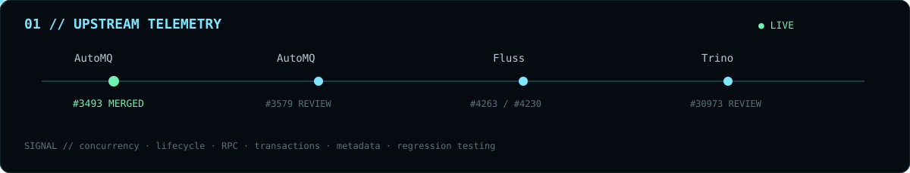
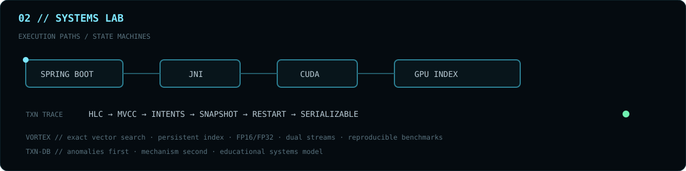

<div align="center">


<br>

**`BACKEND ARCHITECT X // DISTRIBUTED SYSTEMS ENGINEER`**

`JAVA` · `SPRING BOOT` · `KAFKA` · `NETTY` · `REST/gRPC` · `SQL` · `REDIS` · `KUBERNETES` · `AWS`

[GitHub](https://github.com/BackendArchitectX) · [Email](mailto:pranayp.kadu@gmail.com)

<sub>Engineering for correctness under concurrency, failure recovery, resource lifecycle, throughput and operability.</sub>

</div>

<br>



### `MERGED SIGNAL // AutoMQ #3493`

[**controller-only AutoBalancer reporter fix →**](https://github.com/AutoMQ/automq/pull/3493) **MERGED AFTER MAINTAINER REVIEW + APPROVAL**

```text
DOMAIN      Kafka internals
FAILURE     Invalid broker reporter initialization on controller-only nodes
FIX         Process-role-aware lifecycle guard using Kafka ConfigDef semantics
VALIDATION  Maintainer review + focused regression coverage
STATE       MERGED
```

### `OPEN REVIEW CHANNELS`

| NODE | TRACE | ENGINEERING BOUNDARY |
|:--|:--|:--|
| `AUTOMQ` | [#3579](https://github.com/AutoMQ/automq/pull/3579) | Prometheus authentication · credential validation · endpoint lifecycle |
| `FLUSS` | [#4263](https://github.com/apache/fluss/pull/4263) | RPC identity · stale endpoint reuse · Netty connection lifecycle |
| `FLUSS` | [#4230](https://github.com/apache/fluss/pull/4230) | Paimon metadata mapping · Spark lake reads · predicate pushdown |
| `TRINO` | [#30973](https://github.com/trinodb/trino/pull/30973) | Finalization ownership · transaction race · deterministic tests |

<details>
<summary><code>EXPAND // OPEN TECHNICAL TRACES</code></summary>
<br>

**AutoMQ #3579** — opt-in Basic authentication for the built-in Prometheus endpoint with backward-compatible defaults, endpoint-level policy, configuration validation, credential handling, lifecycle coverage and the OpenTelemetry compatibility change required by the authenticator API.

**Fluss #4263** — endpoint-aware physical RPC identity using `UID + host + port` to prevent stale-but-reachable TabletServer endpoints from being reused while retaining UID-level disconnect semantics.

**Fluss #4230** — configured Paimon table-path resolution independent of Fluss table identity across lake-only reads, lake+log reads and predicate pushdown.

**Trino #30973** — explicit finalization ownership between commit and failure paths so unrelated failures cannot transition an autocommit query to `FAILED` after commit begins while genuine commit failures remain visible.

</details>

<br>



<table>
<tr>
<td width="50%" valign="top">

### `VORTEX // GPU VECTOR ENGINE`

[**Vortex CUDA →**](https://github.com/BackendArchitectX/Vortex-CUDA)

```text
REQUEST
  ↓
SPRING BOOT
  ↓
JNI
  ↓
CUDA
  ↓
GPU-RESIDENT INDEX
```

**Exact vector search** from CUDA kernels through a Java/Spring API boundary.

`persistent indexes` · `fused Top-K` · `FP16/FP32` · `pinned memory` · `dual CUDA streams` · `JNI ownership` · `health/metrics` · `reproducible benchmarks`

</td>
<td width="50%" valign="top">

### `TXN-DB // STATE MACHINE LAB`

[**distrib-txn-db →**](https://github.com/BackendArchitectX/distrib-txn-db)

```text
HLC
 ↓
MVCC
 ↓
WRITE INTENTS
 ↓
SNAPSHOT ISOLATION
 ↓
CLOCK UNCERTAINTY
 ↓
READ RESTART
 ↓
SERIALIZABLE GUARDS
```

A Java systems workshop that exposes anomalies and failure modes before introducing the mechanism that addresses them.

`EDUCATIONAL SYSTEMS MODEL // NOT PRESENTED AS PRODUCTION-COMPLETE`

</td>
</tr>
</table>

<br>


```text
RUNTIME / BACKEND          DISTRIBUTED SYSTEMS        PERFORMANCE              OPERABILITY
────────────────────       ─────────────────────      ───────────────────      ───────────────────
Java / Spring Boot         Kafka / streaming          JFR / profiling          Observability
REST / gRPC / Netty        Transactions               Concurrency              Docker / Kubernetes
SQL / Redis / caching      Consistency                Resource lifecycle       AWS / CI/CD
API design                 Failure recovery           Deterministic tests      Production operations
```

<div align="center">

### `ENGINEERING POLICY`

> **Correctness before cleverness. Make failure states explicit. Test races deterministically. Own resource lifecycle.**

</div>

<br>


<div align="center">

`FOCUS LOCKED // DISTRIBUTED SYSTEMS · STORAGE · STREAMING · CONCURRENCY · RELIABILITY · PERFORMANCE`

<br>

<sub>Tracing races, failure boundaries, resource ownership and state transitions across real systems.</sub>

<br><br>

`BACKEND ARCHITECT X // END OF TRANSMISSION`

<br><br>


</div>
