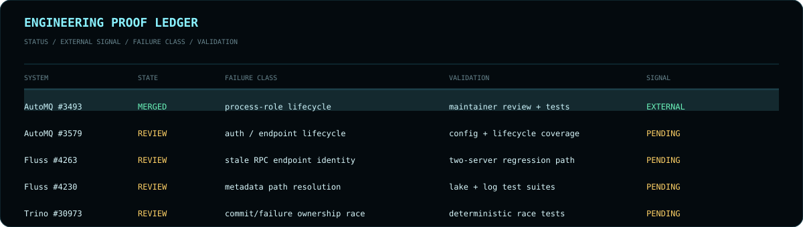
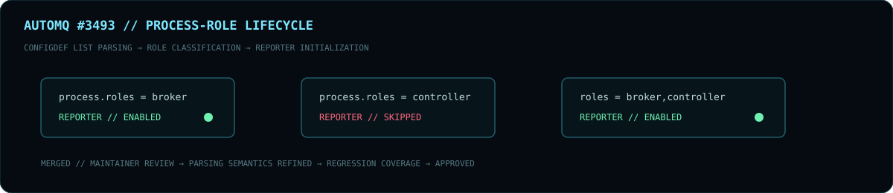
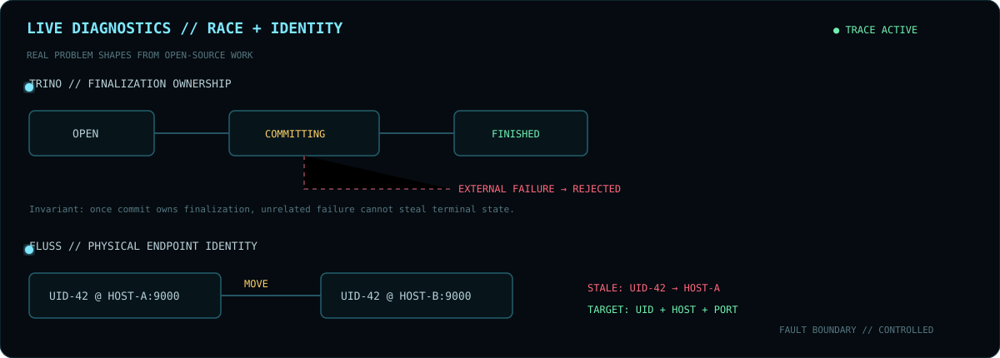
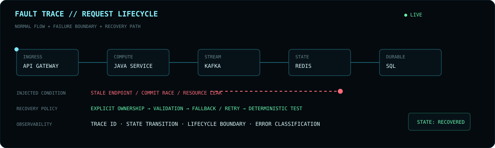
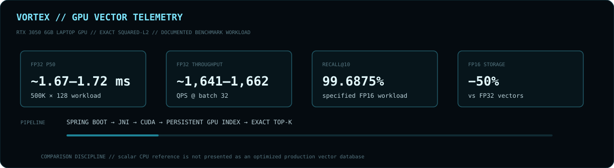
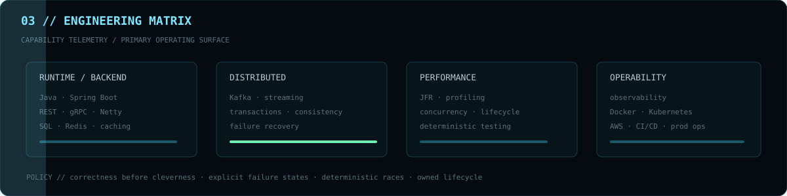
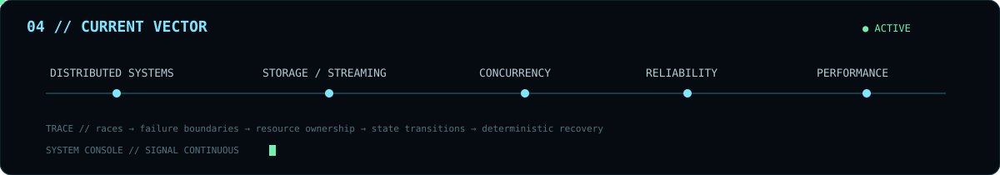
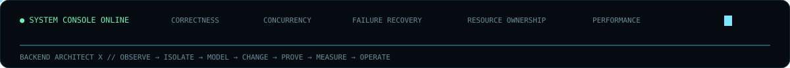

<div align="center">



<br>

**`BACKEND ARCHITECT X // DISTRIBUTED SYSTEMS ENGINEER`**

`JAVA` · `SPRING BOOT` · `KAFKA` · `NETTY` · `REST/gRPC` · `SQL` · `REDIS` · `KUBERNETES` · `AWS`

[GitHub](https://github.com/BackendArchitectX) · [Email](mailto:pranayp.kadu@gmail.com)

<sub>Correctness under concurrency · failure recovery · resource lifecycle · performance · operability</sub>

</div>

---

## `00 // MISSION PROFILE`

```text
OPERATOR      Pranay Kadu / BackendArchitectX
ROLE          Backend & Distributed Systems Engineer
PRIMARY       Java / JVM / Spring Boot
SYSTEMS       Kafka / Netty / gRPC / transactions / streaming
DATA          SQL / Redis / metadata / durable state
RUNTIME       Docker / Kubernetes / AWS / CI-CD
FOCUS         concurrency / correctness / failure recovery / performance
METHOD        explicit ownership / deterministic tests / observable failure boundaries
```

> I focus on the points where systems stop being simple: concurrent finalization, stale endpoints, process-role mismatches, resource ownership, asynchronous shutdown, metadata indirection and state transitions that must remain correct under failure.

---



## `01 // UPSTREAM SIGNAL`



### `MERGED // EXTERNALLY VALIDATED`

#### [AutoMQ #3493 — controller-only AutoBalancer reporter fix](https://github.com/AutoMQ/automq/pull/3493)

```text
FAULT       Broker-only metrics reporter initialized on controller-only process
BOUNDARY    Kafka process-role configuration / reporter lifecycle
CHANGE      Skip reporter initialization for controller-only nodes
DETAIL      Reuse Kafka ConfigDef LIST parsing semantics for real role inputs
TESTING     Focused process-role + lifecycle regression coverage
SIGNAL      Maintainer feedback incorporated → revised → approved → merged
```

**Why this signal matters:** the implementation survived external design feedback. The final shape became simpler and more aligned with Kafka's own parsing semantics before maintainer approval.

### `OPEN REVIEW CHANNELS`

| SYSTEM | TRACE | FAILURE / DESIGN BOUNDARY | VALIDATION PATH |
|:--|:--|:--|:--|
| `AUTOMQ` | [#3579](https://github.com/AutoMQ/automq/pull/3579) | Prometheus authentication · credential policy · endpoint lifecycle | configuration validation · endpoint policy · lifecycle tests |
| `FLUSS` | [#4263](https://github.com/apache/fluss/pull/4263) | stale TabletServer endpoint reuse · RPC connection identity | two live Netty servers · same UID / different endpoint regression |
| `FLUSS` | [#4230](https://github.com/apache/fluss/pull/4230) | custom Paimon path mapping · Spark lake reads | lake-only + lake/log suites · predicate pushdown coverage |
| `TRINO` | [#30973](https://github.com/trinodb/trino/pull/30973) | autocommit commit/failure race · finalization ownership | deterministic blocking commit manager · race-path tests |

<details>
<summary><code>EXPAND // TECHNICAL TRACE BUFFER</code></summary>
<br>

**AutoMQ #3579** — opt-in Basic authentication for the built-in Prometheus endpoint while preserving unauthenticated defaults. The proposal isolates endpoint policy, validates configuration and credentials, covers lifecycle behavior and includes the OpenTelemetry compatibility change required by the authenticator API.

**Fluss #4263** — physical RPC connection identity changes from logical UID alone to `UID + host + port`. The target failure is a stale-but-reachable TabletServer endpoint being reused after a server moves. Regression coverage uses separate live endpoints sharing the same logical UID.

**Fluss #4230** — configured Paimon table-path resolution is separated from Fluss table identity so custom mappings work across lake-only reads, lake+log reads and predicate pushdown paths.

**Trino #30973** — explicit finalization ownership separates commit and failure paths so unrelated failures cannot mark an autocommit query failed after commit begins while genuine commit failures remain reportable. Tests deliberately block commit to force otherwise timing-sensitive race windows.

</details>

---



## `02 // REAL FAILURE SHAPES`

The profile is intentionally organized around **failure boundaries**, not a list of frameworks.

### `TRINO // FINALIZATION OWNERSHIP`

```text
NORMAL
OPEN ─────────────→ COMMITTING ─────────────→ FINISHED
                         │
                         └── external failure arrives
                                  ↓
                              REJECTED

COMMIT FAILURE
OPEN ─────────────→ COMMITTING ─────────────→ FAILED
```

**Invariant:** once the commit path owns finalization, an unrelated failure must not steal terminal state. A genuine commit failure still needs a legal path to `FAILED`.

### `FLUSS // LOGICAL IDENTITY ≠ PHYSICAL LOCATION`

```text
BEFORE
connectionKey = serverUid
UID-42 ─────────→ host-A:9000
server moves
UID-42 ─────────→ host-B:9000
cache can still resolve the old physical connection

PROPOSED
connectionKey = UID + host + port
UID-42@host-A:9000  ≠  UID-42@host-B:9000
```

**Invariant:** logical server identity can remain stable while the physical endpoint changes. Connection identity must represent the physical route actually being reused.

---



## `03 // FAILURE MODEL`

```text
REQUEST
  ↓
VALIDATE / AUTH / RATE LIMIT
  ↓
CLAIM STATE OWNERSHIP
  ↓
REMOTE / STORAGE / STREAMING WORK
  ↓
PARTIAL FAILURE ? ─── yes ──→ CONTAIN / RETRY / FALLBACK / ABORT
  ↓ no                                  ↓
FINALIZE                         RELEASE OWNED RESOURCES
  ↓                                  ↓
EMIT / PERSIST TERMINAL STATE ←──────┘
  ↓
DETERMINISTIC REGRESSION PROOF
```

| CLASS | EXAMPLES | RESPONSE |
|:--|:--|:--|
| `CONCURRENCY` | commit vs failure · cancellation · duplicate completion | atomic ownership · monotonic transitions · controlled race tests |
| `RPC` | stale endpoints · timeout retention · reconnect ambiguity | endpoint-aware identity · explicit disconnect · timeout cleanup |
| `LIFECYCLE` | leaked event loops · surviving schedulers · post-close callbacks | ownership · idempotent close · shutdown verification |
| `CONFIGURATION` | role mismatch · unsafe defaults · ambiguous parsing | source-of-truth parsing · validation · compatible guards |
| `METADATA` | identity/path divergence · stale mapping | explicit mapping · logical/physical separation |
| `PERFORMANCE` | hot allocations · N+1 · cache misses · sync bottlenecks | profiling · batching · caching · bounded concurrency · measurement |

---



## `04 // SYSTEMS LAB`

### `VORTEX // GPU VECTOR ENGINE`

[**Open Vortex CUDA →**](https://github.com/BackendArchitectX/Vortex-CUDA)

```text
REST → SPRING BOOT → JAVA API → JNI → CUDA → GPU-RESIDENT INDEX → EXACT TOP-K
```

**Systems explored:** persistent GPU indexes · exact squared-L2 · hierarchical/fused Top-K · FP16 storage with FP32 accumulation · vectorized access · FMA · pinned host memory · dual CUDA streams · JNI opaque-handle ownership · health/metrics/capacity guards.

**Benchmark discipline:** RTX 3050 6GB Laptop GPU; documented workload and repeatability; FP32 P50 around **1.67–1.72 ms** on 500K×128; around **1,641–1,662 QPS** at batch 32; FP16 provides **50% vector-storage reduction**; documented workload reports **99.6875% Recall@10**. The scalar CPU baseline is explicitly not presented as an optimized production vector database.

### `TXN-DB // DISTRIBUTED STATE LAB`

[**Open distrib-txn-db →**](https://github.com/BackendArchitectX/distrib-txn-db)

```text
HLC → MVCC → ROUTING → TXN RECORDS → WRITE INTENTS
    → SNAPSHOT ISOLATION → CLOCK UNCERTAINTY
    → READ RESTART → SERIALIZABLE CONFLICT PREVENTION
```

**Design rule:** expose the anomaly first, then introduce the mechanism that removes it. The project is an educational systems model, not production-complete infrastructure.

---



## `05 // ENGINEERING MATRIX`

```text
RUNTIME / BACKEND          DISTRIBUTED SYSTEMS        PERFORMANCE              OPERABILITY
────────────────────       ─────────────────────      ───────────────────      ───────────────────
Java / Spring Boot         Kafka / streaming          JFR / profiling          Observability
REST / gRPC / Netty        Transactions               Concurrency              Docker / Kubernetes
SQL / Redis / caching      Consistency                Resource lifecycle       AWS / CI-CD
JPA / Hibernate            Failure recovery           Async execution          Jenkins
API design                 Idempotency                Connection pooling       Cloud monitoring
Authentication             Rate limiting              Query tuning             Production support
```

### `SYSTEMS PRINCIPLES`

```text
01  CORRECTNESS BEFORE CLEVERNESS
02  MAKE FAILURE STATES EXPLICIT
03  SEPARATE LOGICAL IDENTITY FROM PHYSICAL LOCATION
04  ASSUME CALLBACKS CAN ARRIVE AFTER CLOSE
05  OWN THREADS / PERMITS / CONNECTIONS YOU CREATE
06  DESIGN RETRIES AROUND IDEMPOTENCY
07  TEST RACES BY CONTROLLING TIME — NOT BY HOPING TO HIT THEM
08  MEASURE PERFORMANCE BEFORE AND AFTER OPTIMIZATION
09  TREAT OPERABILITY AS PART OF THE DESIGN
10  DISTINGUISH EXTERNAL VALIDATION FROM WORK STILL UNDER REVIEW
```

---

## `06 // OPERATING MODEL`

```text
OBSERVE  ──→ logs / metrics / traces / profiling
ISOLATE  ──→ smallest ownership or state boundary
MODEL    ──→ invariants / legal transitions / failure semantics
CHANGE   ──→ smallest production-safe correction
PROVE    ──→ unit / integration / deterministic regression tests
MEASURE  ──→ latency / throughput / resource behavior
OPERATE  ──→ alerts / dashboards / runbooks / rollback awareness
```

> **Engineering policy:** correctness before cleverness. Make failure states explicit. Test races deterministically. Own resource lifecycle.

---



## `07 // CURRENT VECTOR`

<div align="center">

**`DISTRIBUTED SYSTEMS · STORAGE · STREAMING · CONCURRENCY · RELIABILITY · PERFORMANCE`**

<sub>Tracing races, failure boundaries, resource ownership, endpoint identity, state transitions and recovery semantics across real systems.</sub>

<br><br>



<br>


</div>
