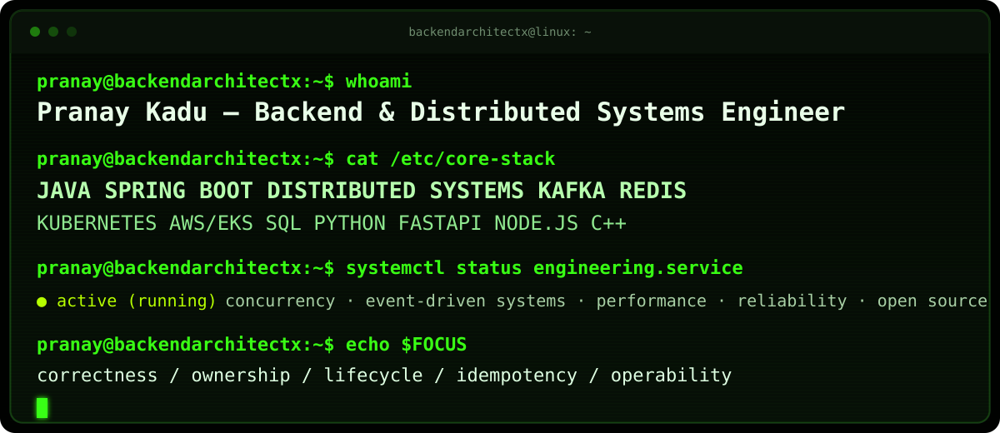

<div align="center">



[**GitHub**](https://github.com/BackendArchitectX) · [**Email**](mailto:pranayp.kadu@gmail.com)

</div>

## `$ cat /proc/impact`

```console
transactions   1M+
p95_latency    -40%
throughput     +15%
uptime         99.8%
mttr           35m -> 12m
```

## `$ cat /etc/skills.conf`

```ini
PRIMARY_BACKEND = Java, J2EE, Spring, Spring Boot, Spring MVC, REST APIs
DISTRIBUTED     = Microservices, Kafka, Event-Driven Architecture, Async Processing
CONCURRENCY     = Multithreading, Concurrency, Caching, Parallel Processing
DATA            = MySQL, PostgreSQL, MongoDB, Redis, SQL Optimization
PLATFORM        = AWS, EKS, Docker, Kubernetes, Jenkins, CI/CD, PCF
OBSERVABILITY   = CloudWatch, Splunk, Dynatrace, JFR
PYTHON          = Python 3, FastAPI, Flask
WEB_API         = Node.js, Express.js, TypeScript, JavaScript, ReactJS
NATIVE          = C++, STL, JNI, CUDA project work
QUALITY         = JUnit, TDD, OOP, SOLID
```

## `$ git log --oneline upstream`

```console
MERGED  AutoMQ #3493   controller-only reporter lifecycle
REVIEW  Trino  #30973  commit / failure finalization ownership
REVIEW  Fluss  #4263   logical UID / physical endpoint identity
REVIEW  AutoMQ #3579   Prometheus authentication lifecycle
REVIEW  Fluss  #4230   Paimon metadata path mapping
```

[**AutoMQ #3493**](https://github.com/AutoMQ/automq/pull/3493) · [**Trino #30973**](https://github.com/trinodb/trino/pull/30973) · [**Fluss #4263**](https://github.com/apache/fluss/pull/4263) · [**AutoMQ #3579**](https://github.com/AutoMQ/automq/pull/3579) · [**Fluss #4230**](https://github.com/apache/fluss/pull/4230)

## `$ tree ~/systems-lab -L 2`

```text
~/systems-lab
├── Vortex-CUDA
│   ├── Spring Boot -> Java -> JNI -> CUDA -> GPU Top-K
│   └── v1.0.0 | 48/48 benchmark cases | M18 smoke validation
│
└── distrib-txn-db
    ├── HLC -> MVCC -> transaction records -> write intents
    └── uncertainty -> read restart -> serializable conflict prevention
```

[**Vortex CUDA →**](https://github.com/BackendArchitectX/Vortex-CUDA) · [**distrib-txn-db →**](https://github.com/BackendArchitectX/distrib-txn-db)

## `$ cat ~/.engineering/invariants`

```text
process-role   -> lifecycle follows source-system semantics
finalization   -> one owner for a terminal state transition
identity       -> logical identity != physical location
lifecycle      -> threads / permits / connections / handles need explicit ownership
race-testing   -> control timing deterministically; do not depend on luck
retries        -> idempotency before replay
operations     -> observability and recovery are part of the design
```

## `$ man backendarchitectx`

```text
NAME
    backendarchitectx - Java-first backend and distributed-systems engineer

SYNOPSIS
    observe -> isolate -> model -> change -> prove -> measure -> operate

FOCUS
    distributed systems / concurrency / reliability / performance / open source
```

<div align="center">


<sub><code>pranay@backendarchitectx:~$ _</code></sub>

</div>