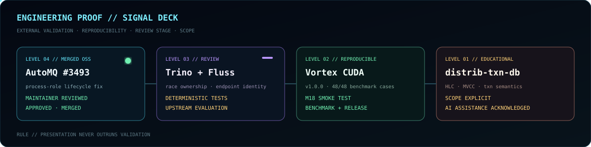
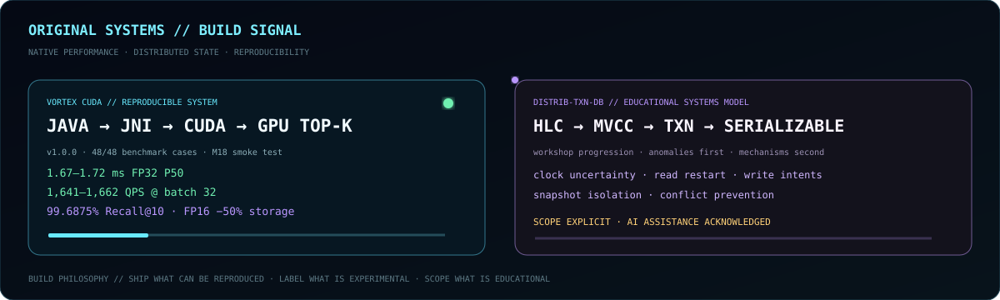

<div align="center">


<br>

**`BACKEND ARCHITECT X // BACKEND & DISTRIBUTED SYSTEMS ENGINEER`**

`MERGED OSS` · `1M+ TXNS` · `99.8% UPTIME` · `VORTEX v1.0.0` · `JAVA-FIRST / MULTI-RUNTIME`

[GitHub](https://github.com/BackendArchitectX) · [Email](mailto:pranayp.kadu@gmail.com)

<sub>Correctness under concurrency · distributed state · failure recovery · performance · operability</sub>

</div>

---



## `01 // SIGNAL`

> **Production impact first. External validation second. Reproducible systems third. Skills only where evidence exists.**

| | PROOF | ENGINEERING BOUNDARY | STATUS |
|:--|:--|:--|:--|
| `OSS` | [**AutoMQ #3493**](https://github.com/AutoMQ/automq/pull/3493) | Kafka process-role / reporter lifecycle | **MERGED** |
| `OSS` | [**Trino #30973**](https://github.com/trinodb/trino/pull/30973) | commit vs failure finalization ownership | **REVIEW** |
| `OSS` | [**Fluss #4263**](https://github.com/apache/fluss/pull/4263) | logical UID vs physical endpoint identity | **REVIEW** |
| `OSS` | [**AutoMQ #3579**](https://github.com/AutoMQ/automq/pull/3579) | Prometheus auth / endpoint lifecycle | **REVIEW** |
| `OSS` | [**Fluss #4230**](https://github.com/apache/fluss/pull/4230) | Paimon metadata mapping / Spark lake reads | **REVIEW** |

<div align="center">

`1M+ transactions` · `p95 −40%` · `throughput +15%` · `99.8% uptime` · `MTTR 35 → 12 min`

</div>

<details>
<summary><code>OPEN // FAILURE INVARIANTS</code></summary>
<br>

```text
PROCESS ROLE     runtime lifecycle follows source-system semantics
FINALIZATION     one owner for terminal state transition
IDENTITY         logical identity != physical location
LIFECYCLE        creator owns threads / permits / connections / native handles
RACE TESTING     control timing; do not rely on probabilistic stress
```

</details>

---



## `02 // BUILD`

<table>
<tr>
<td width="50%" valign="top">

### `VORTEX CUDA`

[**Open repository →**](https://github.com/BackendArchitectX/Vortex-CUDA)

`Spring Boot → Java → JNI → CUDA → GPU Top-K`

**Proof**  
`v1.0.0` · `48/48 benchmark cases` · `M18 smoke test` · architecture/security docs · packaged Windows x64 release

**RTX 3050 / 500K×128**  
FP32 P50 **~1.67–1.72 ms**  
**~1,641–1,662 QPS** @ batch 32  
FP16 **−50% storage**  
**99.6875% Recall@10**

<sub>Exact single-process vector-search engine; not presented as a distributed production vector database.</sub>

</td>
<td width="50%" valign="top">

### `DISTRIB-TXN-DB`

[**Open repository →**](https://github.com/BackendArchitectX/distrib-txn-db)

`HLC → MVCC → TXN RECORDS → INTENTS → READ RESTART → SERIALIZABLE GUARDS`

**Purpose**  
Expose the anomaly first. Add the mechanism second.

**Explores**  
logical clocks · version visibility · distributed routing · snapshot isolation · clock uncertainty · transaction conflicts

<sub>Educational systems model. Scope and AI assistance are explicitly documented.</sub>

</td>
</tr>
</table>

---


## `03 // EXECUTION SURFACE`

```text
PRIMARY       Java · J2EE · Spring · Spring Boot · Spring MVC · REST
PYTHON        Python 3 · FastAPI · Flask
WEB / API     TypeScript · JavaScript · Node.js · Express.js · ReactJS · JSP
SYSTEMS       Kafka · Netty · gRPC · microservices · event-driven · async processing
NATIVE        C++ · STL · JNI / CUDA project work
DATA          MySQL · PostgreSQL · MongoDB · Redis · message queues · SQL tuning
PLATFORM      AWS · EKS · PCF · Docker · Kubernetes · Jenkins · CI/CD
OBSERVE       CloudWatch · Splunk · Dynatrace · JFR
```

**Java/JVM is the primary depth.** Python services, Node/TypeScript/JavaScript, ReactJS and C++/STL extend the same backend engineering surface across APIs, integrations, client delivery and native-performance work.

<details>
<summary><code>OPEN // FULL RESUME-GROUNDED STACK</code></summary>
<br>

`Languages:` Java · J2EE · Python 3 · C++ · TypeScript · JavaScript · SQL  
`Backend:` Spring · Spring Boot · Spring MVC · FastAPI · Flask · Node.js · Express.js · REST APIs · JSP  
`Client:` ReactJS · TypeScript · JavaScript  
`Architecture:` Microservices · Distributed Systems · Event-Driven Architecture · Asynchronous Processing  
`Performance:` Multithreading · Concurrency · Caching · Functional Programming · Parallel Processing · Algorithms  
`Data/Messaging:` MySQL · PostgreSQL · MongoDB · Redis · Kafka · Message Queues · SQL Optimization  
`Quality:` JUnit · TDD · OOP · SOLID · Agile  
`Cloud/DevOps:` AWS · EKS · PCF · CloudWatch · Docker · Kubernetes · Jenkins · CI/CD  
`Tools:` Git · GitHub · Bitbucket · Jira · Splunk · Dynatrace · XML  
`AI tooling:` Claude Sonnet · Claude Opus · GitHub Copilot · AI-powered coding assistants · agent-based tools

</details>

---

## `04 // ENGINEERING LOOP`

<div align="center">

### `OBSERVE → ISOLATE → MODEL → CHANGE → PROVE → MEASURE → OPERATE`

`OWNERSHIP` · `IDENTITY` · `LIFECYCLE` · `IDEMPOTENCY` · `DETERMINISTIC RACES` · `OPERABILITY`

<sub>Correctness before cleverness. Presentation never outruns validation.</sub>

<br><br>


</div>
