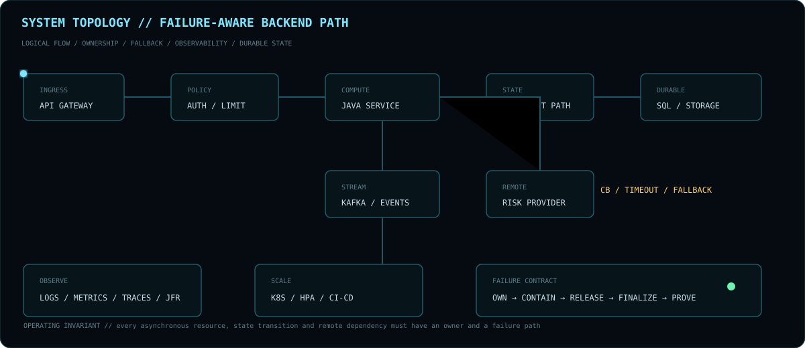
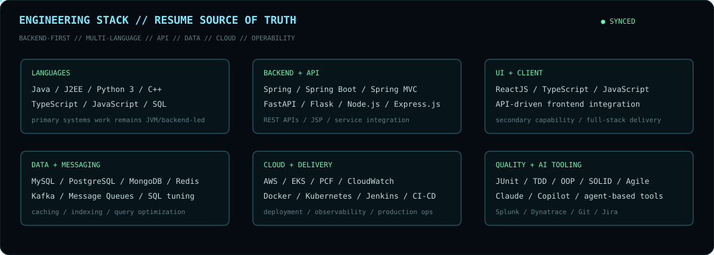

<div align="center">


<br>

**`BACKEND ARCHITECT X // BACKEND & DISTRIBUTED SYSTEMS ENGINEER`**

`JAVA / SPRING` · `PYTHON / FASTAPI / FLASK` · `NODE / TYPESCRIPT / JAVASCRIPT` · `C++ / STL` · `KAFKA` · `NETTY` · `SQL / REDIS` · `KUBERNETES / AWS`

[GitHub](https://github.com/BackendArchitectX) · [Email](mailto:pranayp.kadu@gmail.com)

<sub>Correctness · concurrency · distributed state · failure recovery · performance · operability</sub>

</div>

---

## `01 // SYSTEMS PROFILE`



**Java/JVM is the primary systems surface.** Python/FastAPI/Flask, Node.js/Express.js, TypeScript/JavaScript, ReactJS and C++/STL extend that core across APIs, integrations, full-stack delivery and native-performance boundaries.

```text
CLIENT / INTEGRATION     ReactJS · TypeScript · JavaScript · Node.js · Express.js
SERVICE RUNTIMES         Java / Spring Boot · Python / FastAPI / Flask
DISTRIBUTED CORE         Kafka · Netty · gRPC · transactions · async processing
STATE                    MySQL · PostgreSQL · MongoDB · Redis · SQL optimization
NATIVE / PERFORMANCE     C++ · STL · JNI / CUDA project work · JFR · concurrency
OPERABILITY              AWS · EKS · Docker · Kubernetes · Jenkins · CloudWatch · Splunk · Dynatrace
```

> I focus on systems where correctness depends on **ownership, identity, lifecycle and legal state transitions under failure**.

---

## `02 // ENGINEERING EVIDENCE`


| SIGNAL | PROBLEM | PROOF | STATUS |
|:--|:--|:--|:--|
| [**AutoMQ #3493**](https://github.com/AutoMQ/automq/pull/3493) | controller-only reporter lifecycle | process-role regression tests + maintainer review | **MERGED** |
| [**Trino #30973**](https://github.com/trinodb/trino/pull/30973) | commit/failure finalization race | atomic ownership + deterministic blocking-commit tests | **UNDER REVIEW** |
| [**Fluss #4263**](https://github.com/apache/fluss/pull/4263) | stale physical endpoint reuse | endpoint-aware connection identity + two-server regression | **UNDER REVIEW** |
| [**AutoMQ #3579**](https://github.com/AutoMQ/automq/pull/3579) | Prometheus endpoint authentication | config, policy and lifecycle coverage | **UNDER REVIEW** |
| [**Fluss #4230**](https://github.com/apache/fluss/pull/4230) | custom Paimon table paths | lake-only + lake/log + predicate tests | **UNDER REVIEW** |

**Evidence policy:** merged upstream > reviewed proposal > reproducible test/benchmark > design intent.

<details>
<summary><code>EXPAND // FAILURE INVARIANTS</code></summary>
<br>

- **AutoMQ:** reporter lifecycle must follow Kafka process-role semantics.
- **Trino:** once commit owns finalization, unrelated failure cannot steal terminal state.
- **Fluss:** logical server identity must not be confused with physical endpoint identity.
- **Lifecycle:** creators own threads, permits, connections and native handles unless ownership is explicitly transferred.
- **Testing:** race windows should be forced deterministically rather than discovered probabilistically.

</details>

---

## `03 // SYSTEMS LAB`

### `VORTEX // GPU VECTOR ENGINE`


[**Vortex CUDA →**](https://github.com/BackendArchitectX/Vortex-CUDA)

`Spring Boot → Java API → JNI → pinned host memory → CUDA streams → GPU-resident index → exact Top-K`

**Documented workload:** RTX 3050 6GB Laptop GPU · 500K×128 · FP32 P50 ~**1.67–1.72 ms** · ~**1,641–1,662 QPS** @ batch 32 · FP16 **50% storage reduction** · **99.6875% Recall@10** on the specified FP16 workload.

### `DISTRIB-TXN-DB // DISTRIBUTED STATE LAB`

[**distrib-txn-db →**](https://github.com/BackendArchitectX/distrib-txn-db)

`HLC → MVCC → routing → txn records → write intents → snapshot isolation → clock uncertainty → read restart → serializable guards`

**Design rule:** expose the anomaly first, then introduce the mechanism that removes it. `EDUCATIONAL SYSTEMS MODEL`.

---

## `04 // STACK`



```text
LANGUAGES     Java · J2EE · Python 3 · C++ · TypeScript · JavaScript · SQL
BACKEND       Spring · Spring Boot · Spring MVC · FastAPI · Flask · Node.js · Express.js · REST · JSP
CLIENT        ReactJS · TypeScript · JavaScript
SYSTEMS       Microservices · distributed systems · event-driven architecture · async processing
DATA          MySQL · PostgreSQL · MongoDB · Redis · Kafka · message queues · SQL optimization
PERFORMANCE   multithreading · concurrency · caching · parallel processing · JFR · connection pooling
QUALITY       JUnit · TDD · OOP · SOLID · Agile
CLOUD         AWS · EKS · PCF · Docker · Kubernetes · Jenkins · CI/CD
OBSERVABILITY CloudWatch · Splunk · Dynatrace
AI TOOLING    Claude Sonnet · Claude Opus · GitHub Copilot · agent-based coding tools
```

---

## `05 // ENGINEERING MODEL`

```text
OBSERVE → ISOLATE → MODEL INVARIANT → CHANGE → PROVE → MEASURE → OPERATE
```

**Principles:** correctness before cleverness · explicit failure states · logical identity ≠ physical location · own resource lifecycle · idempotent retries · deterministic race tests · measure before/after optimization · operability is part of design.

---

<div align="center">


<br>

**`DISTRIBUTED SYSTEMS · STORAGE · STREAMING · CONCURRENCY · RELIABILITY · PERFORMANCE`**

<br>


</div>
