 

[**GitHub**](https://github.com/BackendArchitectX) · [**Email**](mailto:pranayp.kadu@gmail.com)

 

[**AutoMQ #3493 · MERGED**](https://github.com/AutoMQ/automq/pull/3493) · [Trino #30973](https://github.com/trinodb/trino/pull/30973) · [Fluss #4263](https://github.com/apache/fluss/pull/4263) · [AutoMQ #3579](https://github.com/AutoMQ/automq/pull/3579) · [Fluss #4230](https://github.com/apache/fluss/pull/4230)

[**Vortex CUDA →**](https://github.com/BackendArchitectX/Vortex-CUDA) · [**distrib-txn-db →**](https://github.com/BackendArchitectX/distrib-txn-db)

<b>Full Technology Stack</b>

 

**Languages** — Java · J2EE · Python 3 · C++ · TypeScript · JavaScript · SQL  
**Backend & APIs** — Spring · Spring Boot · Spring MVC · FastAPI · Flask · Node.js · Express.js · REST APIs · JSP  
**Architecture** — Microservices · Distributed Systems · Event-Driven Architecture · Asynchronous Processing  
**Performance** — Multithreading · Concurrency · Caching · Functional Programming · Parallel Processing · Algorithms · JFR  
**Data & Messaging** — MySQL · PostgreSQL · MongoDB · Redis · Kafka · Message Queues · SQL Optimization  
**Cloud & DevOps** — AWS · EKS · PCF · Docker · Kubernetes · Jenkins · CI/CD · CloudWatch  
**Quality & Tools** — JUnit · TDD · OOP · SOLID · Git · GitHub · Bitbucket · Jira · Splunk · Dynatrace

 

