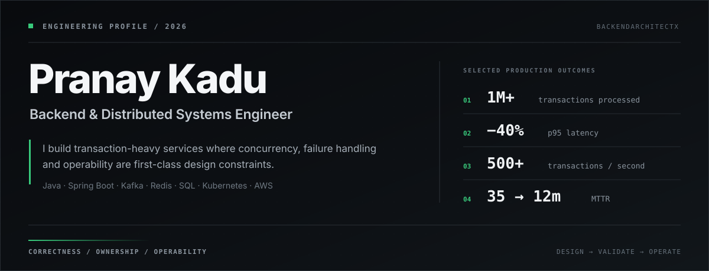

## Selected systems

### [Vortex CUDA](https://github.com/BackendArchitectX/Vortex-CUDA)

An exact vector-search engine built from the CUDA kernel upward through C++20, Java JNI and a hardened Spring Boot API. The system keeps indexes resident on the GPU, supports FP32 and FP16-storage modes and includes a reproducible benchmark harness.

**Measured evidence:** 16.7× lower P50 latency than the project’s scalar CPU reference on `500K × 128` vectors · 1,641–1,662 FP32 QPS at batch 32 · 48/48 benchmark cases passed

[Architecture](https://github.com/BackendArchitectX/Vortex-CUDA/blob/main/docs/ARCHITECTURE.md) · [Benchmark methodology](https://github.com/BackendArchitectX/Vortex-CUDA/blob/main/docs/BENCHMARKS.md) · [v1.0.0 release](https://github.com/BackendArchitectX/Vortex-CUDA/releases/tag/v1.0.0)

### [distrib-txn-db](https://github.com/BackendArchitectX/distrib-txn-db)

A Java workshop that develops a distributed transactional key-value store in six deliberate stages: hybrid logical clocks, MVCC, distributed routing, transaction records and intents, clock-uncertainty restarts and serializable conflict prevention.

**Engineering focus:** transaction ownership · snapshot isolation · write skew · uncertainty windows · read restart · intent resolution

## Upstream engineering

| Project | Engineering problem | Status |
|---|---|---:|
| [AutoMQ #3493](https://github.com/AutoMQ/automq/pull/3493) | Prevent the metrics reporter from starting on controller-only nodes | **Merged** |
| [Trino #30973](https://github.com/trinodb/trino/pull/30973) | Coordinate query failure with transaction-commit ownership | Review |
| [Fluss #4263](https://github.com/apache/fluss/pull/4263) | Make cached RPC connection identity endpoint-aware | Review |
| [AutoMQ #3579](https://github.com/AutoMQ/automq/pull/3579) | Add optional authentication to the built-in Prometheus endpoint | Review |
| [Fluss #4230](https://github.com/apache/fluss/pull/4230) | Support custom Paimon lake-table paths in Spark reads | Review |

## Engineering range

**Backend** — Java 8–21 · Spring Boot · REST · gRPC · concurrency · asynchronous processing  
**Data and messaging** — PostgreSQL · MySQL · MongoDB · Redis · Kafka · event-driven systems  
**Reliability and performance** — idempotency · rate limiting · circuit breakers · caching · SQL tuning · JFR  
**Platform and operations** — Docker · Kubernetes · AWS EKS · Jenkins · CI/CD · CloudWatch · Splunk · Dynatrace  
**Validation** — JUnit · Mockito · deterministic race tests · benchmark design · production telemetry

---

[Email](mailto:pranayp.kadu@gmail.com) · [GitHub](https://github.com/BackendArchitectX)
