 

[**GitHub**](https://github.com/BackendArchitectX) · [**Email**](mailto:pranayp.kadu@gmail.com)

[**AutoMQ #3493 · MERGED**](https://github.com/AutoMQ/automq/pull/3493) · [Trino #30973](https://github.com/trinodb/trino/pull/30973) · [Fluss #4263](https://github.com/apache/fluss/pull/4263) · [AutoMQ #3579](https://github.com/AutoMQ/automq/pull/3579) · [Fluss #4230](https://github.com/apache/fluss/pull/4230)

[**Vortex CUDA →**](https://github.com/BackendArchitectX/Vortex-CUDA) · [**distrib-txn-db →**](https://github.com/BackendArchitectX/distrib-txn-db)

<b>Full resume-grounded execution surface</b>

 

`Languages` — Java · J2EE · Python 3 · C++ · TypeScript · JavaScript · SQL  
`Backend` — Spring · Spring Boot · Spring MVC · FastAPI · Flask · Node.js · Express.js · REST APIs · JSP  
`Client` — ReactJS · TypeScript · JavaScript  
`Architecture` — Microservices · Distributed Systems · Event-Driven Architecture · Asynchronous Processing  
`Performance` — Multithreading · Concurrency · Caching · Functional Programming · Parallel Processing · Algorithms  
`Data / Messaging` — MySQL · PostgreSQL · MongoDB · Redis · Kafka · Message Queues · SQL Optimization  
`Quality` — JUnit · TDD · OOP · SOLID · Agile  
`Cloud / DevOps` — AWS · EKS · PCF · CloudWatch · Docker · Kubernetes · Jenkins · CI/CD  
`Tools` — Git · GitHub · Bitbucket · Jira · Splunk · Dynatrace · XML  
`AI tooling` — Claude Sonnet · Claude Opus · GitHub Copilot · AI-powered coding assistants · agent-based tools

 

