<picture>
  <source media="(prefers-color-scheme: dark)" srcset="./assets/apex-spatial-hero-dark-2026.svg">
  <source media="(prefers-color-scheme: light)" srcset="./assets/apex-spatial-hero-light-2026.svg">
  
</picture>

 

[**GitHub**](https://github.com/BackendArchitectX) · [**Email**](mailto:pranayp.kadu@gmail.com)

`JAVA / SPRING` · `PYTHON / FASTAPI / FLASK` · `NODE / TYPESCRIPT / JAVASCRIPT` · `C++ / STL` · `KAFKA` · `REDIS` · `KUBERNETES / AWS`

 

## `01 / PROOF`

[**AutoMQ #3493 · MERGED**](https://github.com/AutoMQ/automq/pull/3493) · [**Trino #30973**](https://github.com/trinodb/trino/pull/30973) · [**Fluss #4263**](https://github.com/apache/fluss/pull/4263) · [**AutoMQ #3579**](https://github.com/AutoMQ/automq/pull/3579) · [**Fluss #4230**](https://github.com/apache/fluss/pull/4230)

External validation is kept separate from work still under review.

 

## `02 / SYSTEMS`

### **Vortex CUDA**

[**Open repository →**](https://github.com/BackendArchitectX/Vortex-CUDA)  
Exact GPU vector search across **Spring Boot → Java → JNI → CUDA → GPU-resident Top-K**.

`v1.0.0` · `48/48 benchmark cases` · `M18 end-to-end smoke validation` · RTX 3050 6GB · FP32 P50 **~1.67–1.72 ms** · **~1,641–1,662 QPS** @ batch 32 · FP16 **−50% storage** · **99.6875% Recall@10**

### **distrib-txn-db**

[**Open repository →**](https://github.com/BackendArchitectX/distrib-txn-db)  
An anomaly-first distributed state lab exploring **HLC → MVCC → transaction records → write intents → uncertainty → read restart → serializable conflict prevention**.

Educational systems model; scope and AI assistance are explicitly documented in the repository.

 

## `03 / EXECUTION SURFACE`

**Primary** — Java · J2EE · Spring · Spring Boot · Spring MVC · REST APIs  
**Python** — Python 3 · FastAPI · Flask  
**Web / API** — TypeScript · JavaScript · Node.js · Express.js · ReactJS · JSP  
**Systems** — Kafka · Netty · gRPC · Microservices · Event-Driven Architecture · Async Processing  
**Native** — C++ · STL · JNI / CUDA project work  
**Data** — MySQL · PostgreSQL · MongoDB · Redis · Message Queues · SQL Optimization  
**Platform** — AWS · EKS · PCF · Docker · Kubernetes · Jenkins · CI/CD  
**Observe** — CloudWatch · Splunk · Dynatrace · JFR

<b>Full resume-grounded stack</b>

 

`Languages` — Java · J2EE · Python 3 · C++ · TypeScript · JavaScript · SQL  
`Backend` — Spring · Spring Boot · Spring MVC · FastAPI · Flask · Node.js · Express.js · REST APIs · JSP  
`Client` — ReactJS · TypeScript · JavaScript  
`Architecture` — Microservices · Distributed Systems · Event-Driven Architecture · Asynchronous Processing  
`Performance` — Multithreading · Concurrency · Caching · Functional Programming · Parallel Processing · Algorithms  
`Data / Messaging` — MySQL · PostgreSQL · MongoDB · Redis · Kafka · Message Queues · SQL Optimization  
`Quality` — JUnit · TDD · OOP · SOLID · Agile  
`Cloud / DevOps` — AWS · EKS · PCF · CloudWatch · Docker · Kubernetes · Jenkins · CI/CD  
`Tools` — Git · GitHub · Bitbucket · Jira · Splunk · Dynatrace · XML  
`AI tooling` — Claude Sonnet · Claude Opus · GitHub Copilot · AI-powered coding assistants · agent-based tools

 

## `04 / ENGINEERING MODE`

### `OBSERVE → ISOLATE → MODEL → CHANGE → PROVE → MEASURE → OPERATE`

`OWNERSHIP` · `IDENTITY` · `LIFECYCLE` · `IDEMPOTENCY` · `DETERMINISTIC RACES` · `OPERABILITY`

Correctness before cleverness. Presentation never outruns validation.

  

