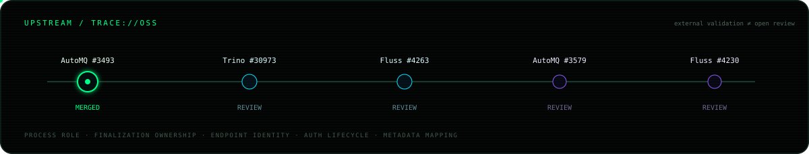

 

[**GitHub**](https://github.com/BackendArchitectX) · [**Email**](mailto:pranayp.kadu@gmail.com)

Java-first backend & distributed-systems engineering across multi-runtime services, concurrency, performance, reliability and production operations.

 

## `UPSTREAM // SIGNAL`

[**AutoMQ #3493 · MERGED**](https://github.com/AutoMQ/automq/pull/3493) · [Trino #30973](https://github.com/trinodb/trino/pull/30973) · [Fluss #4263](https://github.com/apache/fluss/pull/4263) · [AutoMQ #3579](https://github.com/AutoMQ/automq/pull/3579) · [Fluss #4230](https://github.com/apache/fluss/pull/4230)

Process-role lifecycle · finalization ownership · endpoint identity · auth lifecycle · metadata mapping

<code>inspect --failure-invariants</code>

 

`process-role` → runtime lifecycle follows source-system semantics  
`finalization` → one owner for terminal state transition  
`identity` → logical identity ≠ physical location  
`lifecycle` → creator owns threads / permits / connections / native handles  
`race-testing` → force timing deterministically; never depend on chance

 

## `SYSTEMS // CORE`

[**Vortex CUDA →**](https://github.com/BackendArchitectX/Vortex-CUDA) · [**distrib-txn-db →**](https://github.com/BackendArchitectX/distrib-txn-db)

 

## `EXECUTION // SURFACE`

**Java / J2EE / Spring / Spring Boot / REST**  
Python / FastAPI / Flask · TypeScript / JavaScript / Node.js / Express.js / ReactJS · C++ / STL  
Kafka / Netty / gRPC · MySQL / PostgreSQL / MongoDB / Redis · AWS / EKS / Docker / Kubernetes / Jenkins · CloudWatch / Splunk / Dynatrace / JFR

<b>Full resume-grounded stack</b>

 

`Languages` — Java · J2EE · Python 3 · C++ · TypeScript · JavaScript · SQL  
`Backend` — Spring · Spring Boot · Spring MVC · FastAPI · Flask · Node.js · Express.js · REST APIs · JSP  
`Client` — ReactJS · TypeScript · JavaScript  
`Architecture` — Microservices · Distributed Systems · Event-Driven Architecture · Asynchronous Processing  
`Performance` — Multithreading · Concurrency · Caching · Functional Programming · Parallel Processing · Algorithms  
`Data / Messaging` — MySQL · PostgreSQL · MongoDB · Redis · Kafka · Message Queues · SQL Optimization  
`Quality` — JUnit · TDD · OOP · SOLID · Agile  
`Cloud / DevOps` — AWS · EKS · PCF · CloudWatch · Docker · Kubernetes · Jenkins · CI/CD  
`Tools` — Git · GitHub · Bitbucket · Jira · Splunk · Dynatrace · XML  
`AI tooling` — Claude Sonnet · Claude Opus · GitHub Copilot · AI-powered coding assistants · agent-based tools

 

`OBSERVE → ISOLATE → MODEL → CHANGE → PROVE → MEASURE → OPERATE`

Ownership · identity · lifecycle · idempotency · deterministic races · operability

  

