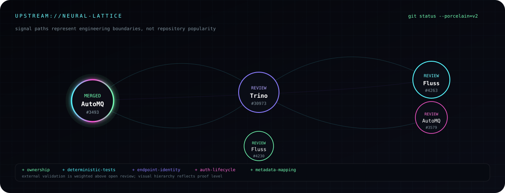

<div align="center">



<br>

### `BACKEND ARCHITECT X // DISTRIBUTED SYSTEMS ENGINEER`

[GitHub](https://github.com/BackendArchitectX) · [Email](mailto:pranayp.kadu@gmail.com)

`JAVA / SPRING` · `PYTHON / FASTAPI / FLASK` · `NODE / TYPESCRIPT / JAVASCRIPT` · `C++ / STL` · `KAFKA` · `REDIS` · `KUBERNETES / AWS`

<sub>Correctness under concurrency · distributed state · lifecycle ownership · performance · operability</sub>

</div>

<br>

## `01 // UPSTREAM SIGNAL`



<div align="center">

[**AutoMQ #3493 · MERGED**](https://github.com/AutoMQ/automq/pull/3493) · [Trino #30973](https://github.com/trinodb/trino/pull/30973) · [Fluss #4263](https://github.com/apache/fluss/pull/4263) · [AutoMQ #3579](https://github.com/AutoMQ/automq/pull/3579) · [Fluss #4230](https://github.com/apache/fluss/pull/4230)

</div>

<details>
<summary><code>inspect --engineering-invariants</code></summary>
<br>

```text
process-role   runtime lifecycle follows source-system semantics
finalization   one owner for terminal state transition
identity       logical identity != physical location
lifecycle      creator owns threads / permits / connections / native handles
race-testing   force timing deterministically; never depend on luck
```

</details>

<br>

## `02 // SYSTEMS LAB`



<div align="center">

[**Vortex CUDA →**](https://github.com/BackendArchitectX/Vortex-CUDA) · [**distrib-txn-db →**](https://github.com/BackendArchitectX/distrib-txn-db)

</div>

<br>

## `03 // EXECUTION SURFACE`

<div align="center">

**PRIMARY** — Java · J2EE · Spring · Spring Boot · Spring MVC · REST APIs  
**PYTHON** — Python 3 · FastAPI · Flask  
**WEB / API** — TypeScript · JavaScript · Node.js · Express.js · ReactJS · JSP  
**SYSTEMS** — Kafka · Netty · gRPC · Microservices · Event-Driven Architecture · Async Processing  
**NATIVE** — C++ · STL · JNI / CUDA project work  
**DATA** — MySQL · PostgreSQL · MongoDB · Redis · Message Queues · SQL Optimization  
**PLATFORM** — AWS · EKS · PCF · Docker · Kubernetes · Jenkins · CI/CD  
**OBSERVE** — CloudWatch · Splunk · Dynatrace · JFR

</div>

<details>
<summary><code>cat /etc/backendarchitectx/stack.conf --full</code></summary>
<br>

`Languages` — Java · J2EE · Python 3 · C++ · TypeScript · JavaScript · SQL  
`Backend` — Spring · Spring Boot · Spring MVC · FastAPI · Flask · Node.js · Express.js · REST APIs · JSP  
`Client` — ReactJS · TypeScript · JavaScript  
`Architecture` — Microservices · Distributed Systems · Event-Driven Architecture · Asynchronous Processing  
`Performance` — Multithreading · Concurrency · Caching · Functional Programming · Parallel Processing · Algorithms  
`Data / Messaging` — MySQL · PostgreSQL · MongoDB · Redis · Kafka · Message Queues · SQL Optimization  
`Quality` — JUnit · TDD · OOP · SOLID · Agile  
`Cloud / DevOps` — AWS · EKS · PCF · CloudWatch · Docker · Kubernetes · Jenkins · CI/CD  
`Tools` — Git · GitHub · Bitbucket · Jira · Splunk · Dynatrace · XML  
`AI tooling` — Claude Sonnet · Claude Opus · GitHub Copilot · AI-powered coding assistants · agent-based tools

</details>

<br>

## `04 // ENGINEERING DOCTRINE`

```text
OBSERVE → ISOLATE → MODEL → CHANGE → PROVE → MEASURE → OPERATE
```

<div align="center">

`OWNERSHIP` · `IDENTITY` · `LIFECYCLE` · `IDEMPOTENCY` · `DETERMINISTIC RACES` · `OPERABILITY`

<sub>Correctness before cleverness. Presentation never outruns validation.</sub>

<br><br>


</div>
