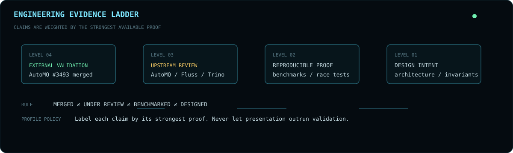
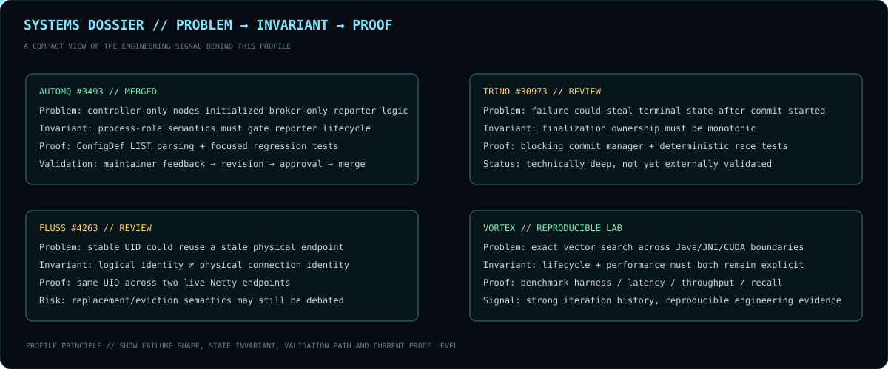

<div align="center">


<br>

**`BACKEND ARCHITECT X // DISTRIBUTED SYSTEMS ENGINEER`**

`JAVA` · `SPRING BOOT` · `KAFKA` · `NETTY` · `REST/gRPC` · `SQL` · `REDIS` · `KUBERNETES` · `AWS`

[GitHub](https://github.com/BackendArchitectX) · [Email](mailto:pranayp.kadu@gmail.com)

<sub>Concurrency · correctness · failure recovery · resource lifecycle · performance · operability</sub>

</div>

---

## `00 // OPERATOR PROFILE`

```text
OPERATOR      Pranay Kadu / BackendArchitectX
ROLE          Backend & Distributed Systems Engineer
PRIMARY       Java / JVM / Spring Boot
SYSTEMS       Kafka / Netty / gRPC / transactions / streaming
DATA          SQL / Redis / metadata / durable state
RUNTIME       Docker / Kubernetes / AWS / CI-CD
METHOD        invariants / ownership / deterministic tests / observable failure boundaries
```

> I am most interested in backend problems where correctness depends on **who owns state, which endpoint is real, which resource must be released, and which transition is still legal after failure begins**.

---



## `01 // EVIDENCE POLICY`

This profile deliberately separates four levels of proof:

```text
LEVEL 04  EXTERNAL VALIDATION   → maintainer-reviewed and merged upstream
LEVEL 03  UPSTREAM REVIEW       → submitted with focused implementation and tests
LEVEL 02  REPRODUCIBLE PROOF    → benchmarks / deterministic regression / test harnesses
LEVEL 01  DESIGN INTENT         → architecture / invariants / implementation direction
```

**Rule:** presentation must never outrun validation. A merged upstream fix is stronger evidence than an open PR; a reproducible benchmark is stronger evidence than a polished architecture diagram.

---



## `02 // PRIMARY ENGINEERING SIGNALS`

### `AUTOMQ #3493 // EXTERNALLY VALIDATED`

[**controller-only AutoBalancer reporter fix →**](https://github.com/AutoMQ/automq/pull/3493)

```text
PROBLEM     Broker-only reporter logic initialized on controller-only nodes
INVARIANT   Reporter lifecycle must respect Kafka process-role semantics
CHANGE      Guard reporter initialization for controller-only processes
DETAIL      Reuse Kafka ConfigDef LIST parsing for real role inputs
PROOF       Focused process-role and lifecycle regression tests
STATUS      Maintainer feedback incorporated → revised → approved → merged
```


This is currently the strongest evidence on the profile because the implementation was **externally challenged, refined and accepted**.

### `TRINO #30973 // FINALIZATION OWNERSHIP`

[**Prevent query failure after transaction commit starts →**](https://github.com/trinodb/trino/pull/30973)

```text
PROBLEM     External failure could race with autocommit finalization
INVARIANT   Once COMMITTING owns finalization, unrelated failure cannot steal it
MODEL       OPEN → COMMITTING → FINISHED
            OPEN → COMMITTING → FAILED   only for genuine commit failure
PROOF       Blocking commit transaction manager + deterministic race tests
STATUS      Open / under review
```

### `FLUSS #4263 // CONNECTION IDENTITY`

[**Handle endpoint changes for cached server connections →**](https://github.com/apache/fluss/pull/4263)

```text
PROBLEM     Stable logical UID could reuse a stale physical endpoint
INVARIANT   Logical server identity is not the same as physical connection identity
CHANGE      Connection key: UID → UID + host + port
PROOF       Two live Netty servers using the same UID and different endpoints
STATUS      Open / under review
RISK        Maintainers may prefer stronger endpoint replacement / eviction semantics
```


### `OTHER OPEN REVIEW CHANNELS`

| SYSTEM | CHANGE | ENGINEERING BOUNDARY |
|:--|:--|:--|
| `AUTOMQ` | [#3579](https://github.com/AutoMQ/automq/pull/3579) | Prometheus authentication · credential validation · endpoint lifecycle |
| `FLUSS` | [#4230](https://github.com/apache/fluss/pull/4230) | Paimon metadata mapping · Spark lake reads · predicate pushdown |

---

## `03 // FAILURE MODEL`


```text
REQUEST
  ↓
VALIDATE / AUTH / RATE LIMIT
  ↓
CLAIM OWNERSHIP
  ↓
REMOTE / STORAGE / STREAMING WORK
  ↓
PARTIAL FAILURE?
  ├─ no  → FINALIZE → EMIT / PERSIST TERMINAL STATE
  └─ yes → CONTAIN / RETRY / FALLBACK / ABORT
                 ↓
        RELEASE OWNED RESOURCES
                 ↓
       PRESERVE LEGAL STATE TRANSITIONS
                 ↓
       DETERMINISTIC REGRESSION PROOF
```

### `FAILURE CLASSES`

| CLASS | FAILURE SHAPE | RESPONSE |
|:--|:--|:--|
| `CONCURRENCY` | commit vs failure · cancellation · duplicate completion | atomic ownership · monotonic transitions · controlled race tests |
| `RPC` | stale endpoint reuse · retained timeouts · reconnect ambiguity | endpoint-aware identity · explicit disconnect semantics |
| `LIFECYCLE` | event-loop leaks · scheduler survival · callbacks after close | explicit ownership · idempotent shutdown · lifecycle verification |
| `CONFIGURATION` | role mismatch · unsafe defaults · inconsistent parsing | reuse source-of-truth parser · validate early · preserve compatibility |
| `METADATA` | logical/physical divergence · stale mapping | isolate mapping layer · separate identity from location |
| `PERFORMANCE` | allocation pressure · N+1 · cache misses · sync bottlenecks | profile · measure · batch · cache · bound concurrency |

---

## `04 // SYSTEMS LAB`


### `VORTEX // GPU VECTOR ENGINE`

[**Vortex CUDA →**](https://github.com/BackendArchitectX/Vortex-CUDA)

```text
REST → SPRING BOOT → JAVA API → JNI → CUDA → GPU-RESIDENT INDEX → EXACT TOP-K
```

**Explores:** persistent GPU indexes · exact squared-L2 search · hierarchical/fused Top-K · FP16 storage with FP32 accumulation · vectorized memory access · FMA · pinned host memory · dual CUDA streams · JNI opaque-handle ownership · health/metrics/capacity guards.

**Documented benchmark signal:** RTX 3050 6GB Laptop GPU · 500K×128 workload · FP32 P50 ~**1.67–1.72 ms** · ~**1,641–1,662 QPS** at batch 32 · **50%** vector-storage reduction with FP16 · **99.6875% Recall@10** on the specified FP16 workload.

**Credibility guard:** the scalar CPU reference is explicitly not presented as an optimized production vector database.

### `DISTRIB-TXN-DB // DISTRIBUTED STATE LAB`

[**distrib-txn-db →**](https://github.com/BackendArchitectX/distrib-txn-db)

```text
HLC
 ↓
MVCC
 ↓
DISTRIBUTED ROUTING
 ↓
TXN RECORDS
 ↓
WRITE INTENTS
 ↓
SNAPSHOT ISOLATION
 ↓
CLOCK UNCERTAINTY
 ↓
READ RESTART
 ↓
SERIALIZABLE CONFLICT PREVENTION
```

**Design rule:** expose the anomaly first, then introduce the mechanism that removes it.

`EDUCATIONAL SYSTEMS MODEL // NOT PRESENTED AS PRODUCTION-COMPLETE INFRASTRUCTURE`

---


## `05 // ENGINEERING MATRIX`

```text
RUNTIME / BACKEND          DISTRIBUTED SYSTEMS        PERFORMANCE              OPERABILITY
────────────────────       ─────────────────────      ───────────────────      ───────────────────
Java / Spring Boot         Kafka / streaming          JFR / profiling          Observability
REST / gRPC / Netty        Transactions               Concurrency              Docker / Kubernetes
SQL / Redis / caching      Consistency                Resource lifecycle       AWS / CI-CD
JPA / Hibernate            Failure recovery           Async execution          Jenkins
API design                 Idempotency                Connection pooling       Cloud monitoring
Authentication             Rate limiting              Query tuning             Production support
```

### `SYSTEMS PRINCIPLES`

```text
01  CORRECTNESS BEFORE CLEVERNESS
02  MAKE FAILURE STATES EXPLICIT
03  SEPARATE LOGICAL IDENTITY FROM PHYSICAL LOCATION
04  ASSUME CALLBACKS CAN ARRIVE AFTER CLOSE
05  OWN THREADS / PERMITS / CONNECTIONS YOU CREATE
06  DESIGN RETRIES AROUND IDEMPOTENCY
07  TEST RACES BY CONTROLLING TIME — NOT BY HOPING TO HIT THEM
08  MEASURE PERFORMANCE BEFORE AND AFTER OPTIMIZATION
09  TREAT OPERABILITY AS PART OF THE DESIGN
10  DISTINGUISH EXTERNAL VALIDATION FROM WORK STILL UNDER REVIEW
```

---

## `06 // OPERATING MODEL`

```text
OBSERVE  → logs / metrics / traces / profiling
ISOLATE  → smallest ownership or state boundary
MODEL    → invariants / legal transitions / failure semantics
CHANGE   → smallest production-safe correction
PROVE    → targeted unit / integration / deterministic regression
MEASURE  → latency / throughput / resource behavior
OPERATE  → alerts / dashboards / runbooks / rollback awareness
```

> **Engineering policy:** correctness before cleverness. Make failure states explicit. Test races deterministically. Own resource lifecycle.

---


## `07 // CURRENT VECTOR`

<div align="center">

**`DISTRIBUTED SYSTEMS · STORAGE · STREAMING · CONCURRENCY · RELIABILITY · PERFORMANCE`**

<sub>Races · failure boundaries · endpoint identity · resource ownership · state transitions · recovery semantics</sub>

<br><br>


<br>


</div>
