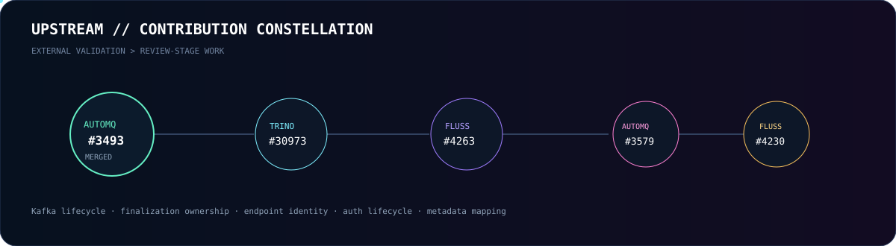
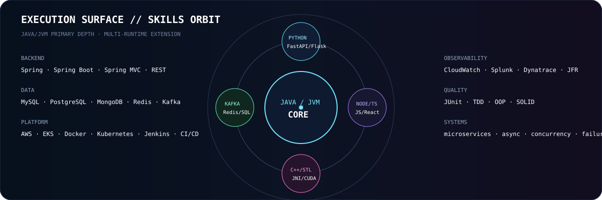

 

### `BACKEND & DISTRIBUTED SYSTEMS ENGINEER`

[GitHub](https://github.com/BackendArchitectX) · [Email](mailto:pranayp.kadu@gmail.com)

Java-first systems engineering across distributed backends, multi-runtime services, performance and production reliability.

 

## `01 / UPSTREAM`

[**AutoMQ #3493 · MERGED**](https://github.com/AutoMQ/automq/pull/3493) · [Trino #30973](https://github.com/trinodb/trino/pull/30973) · [Fluss #4263](https://github.com/apache/fluss/pull/4263) · [AutoMQ #3579](https://github.com/AutoMQ/automq/pull/3579) · [Fluss #4230](https://github.com/apache/fluss/pull/4230)

process-role lifecycle · finalization ownership · endpoint identity · auth lifecycle · metadata mapping

<b>Engineering invariants behind the fixes</b>

 

- Runtime lifecycle must follow source-system process-role semantics.
- Once one path owns a terminal transition, unrelated failure cannot steal it.
- Logical server identity must not silently imply physical endpoint location.
- Threads, permits, connections and native handles require explicit ownership.
- Race windows should be forced deterministically rather than found by chance.

 

## `02 / ORIGINAL SYSTEMS`

<table>
<tr>
<td width="50%" valign="top">

 
<b>Exact GPU vector search from Spring Boot to CUDA.</b> 
Released v1.0.0 · 48/48 benchmark matrix · M18 end-to-end smoke validation · explicit scope boundaries.
</td>
<td width="50%" valign="top">

 
<b>Distributed state model built anomaly-first.</b> 
HLC · MVCC · write intents · uncertainty · read restart · serializable conflict prevention. Educational scope and AI assistance are explicit.
</td>
</tr>
</table>

 

## `03 / EXECUTION SURFACE`

**Java / Spring Boot** · Python / FastAPI / Flask · Node.js / TypeScript / JavaScript · ReactJS · C++ / STL  
Kafka · Redis · MySQL · PostgreSQL · MongoDB · AWS · EKS · Docker · Kubernetes · Jenkins · CloudWatch · Splunk · Dynatrace

<b>Full resume-grounded stack</b>

 

`Languages` — Java · J2EE · Python 3 · C++ · TypeScript · JavaScript · SQL  
`Backend` — Spring · Spring Boot · Spring MVC · FastAPI · Flask · Node.js · Express.js · REST APIs · JSP  
`Client` — ReactJS · TypeScript · JavaScript  
`Architecture` — Microservices · Distributed Systems · Event-Driven Architecture · Asynchronous Processing  
`Performance` — Multithreading · Concurrency · Caching · Functional Programming · Parallel Processing · Algorithms  
`Data / Messaging` — MySQL · PostgreSQL · MongoDB · Redis · Kafka · Message Queues · SQL Optimization  
`Quality` — JUnit · TDD · OOP · SOLID · Agile  
`Cloud / DevOps` — AWS · EKS · PCF · CloudWatch · Docker · Kubernetes · Jenkins · CI/CD  
`Tools` — Git · GitHub · Bitbucket · Jira · Splunk · Dynatrace · XML  
`AI tooling` — Claude Sonnet · Claude Opus · GitHub Copilot · AI-powered coding assistants · agent-based tools

 

## `04 / ENGINEERING MODE`

### `OBSERVE → ISOLATE → MODEL → CHANGE → PROVE → MEASURE → OPERATE`

`OWNERSHIP` · `IDENTITY` · `LIFECYCLE` · `IDEMPOTENCY` · `DETERMINISTIC RACES` · `OPERABILITY`

Correctness before cleverness. Presentation never outruns validation.

  

