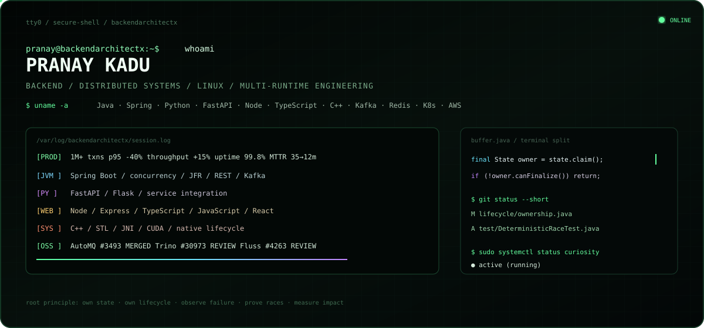
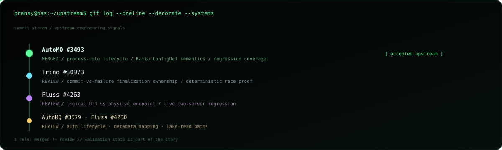
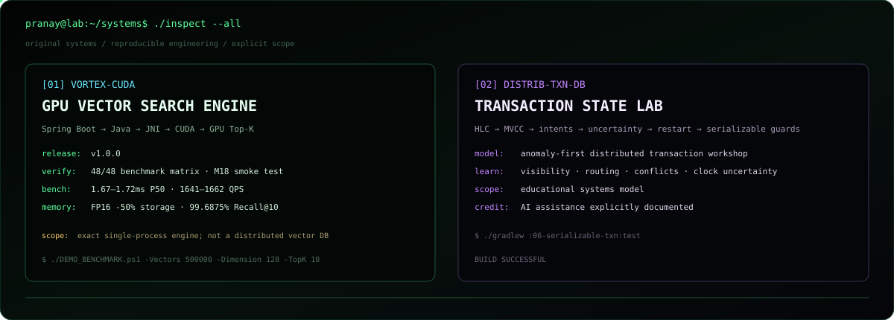
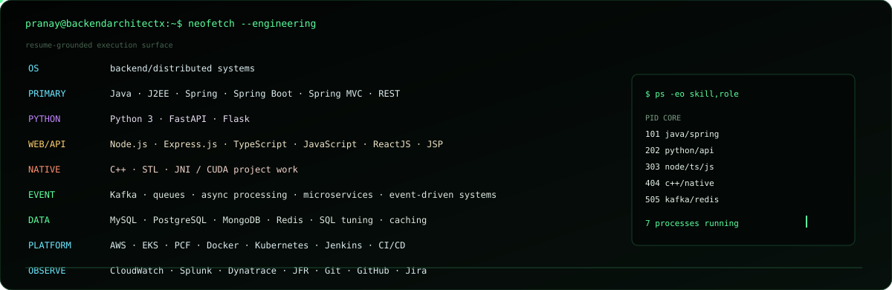

<div align="center">



<br>

### `root@backendarchitectx // BACKEND & DISTRIBUTED SYSTEMS ENGINEER`

[GitHub](https://github.com/BackendArchitectX) · [Email](mailto:pranayp.kadu@gmail.com)

<sub>Java-first backend systems · Linux-minded engineering · multi-runtime services · production reliability</sub>

</div>

---

## `01 // /proc/impact`

```text
scale        1M+ transactions
latency      p95 -40%
throughput   +15%
availability 99.8%
mttr         35 min -> 12 min
```

`Java / Spring Boot` · `Python / FastAPI / Flask` · `C++ / STL` · `Kafka` · `Redis` · `SQL` · `AWS / EKS / Kubernetes`

---

## `02 // ~/upstream/.git`



<div align="center">

[**AutoMQ #3493 · MERGED**](https://github.com/AutoMQ/automq/pull/3493) · [Trino #30973](https://github.com/trinodb/trino/pull/30973) · [Fluss #4263](https://github.com/apache/fluss/pull/4263) · [AutoMQ #3579](https://github.com/AutoMQ/automq/pull/3579) · [Fluss #4230](https://github.com/apache/fluss/pull/4230)

</div>

<details>
<summary><code>$ cat ~/.engineering/invariants</code></summary>
<br>

```text
process-role  -> lifecycle follows source-system semantics
finalization  -> one owner for terminal state transition
identity      -> logical identity != physical location
lifecycle     -> creator owns threads / permits / connections / native handles
race-testing  -> force timing deterministically; never depend on luck
```

</details>

---

## `03 // /opt/systems`



<div align="center">

[**Vortex CUDA**](https://github.com/BackendArchitectX/Vortex-CUDA) · [**distrib-txn-db**](https://github.com/BackendArchitectX/distrib-txn-db)

</div>

<details>
<summary><code>$ ./vortex --proof</code></summary>
<br>

`v1.0.0` · `48/48 benchmark cases` · `M18 end-to-end smoke test` · architecture/security docs · packaged Windows x64 release  
RTX 3050 6GB / 500K×128 · FP32 P50 **~1.67–1.72 ms** · **~1,641–1,662 QPS** @ batch 32 · FP16 **-50% storage** · **99.6875% Recall@10**

</details>

---

## `04 // /etc/stack.conf`



<details>
<summary><code>$ cat /etc/stack.conf --full</code></summary>
<br>

```text
LANGUAGES     Java · J2EE · Python 3 · C++ · TypeScript · JavaScript · SQL
BACKEND       Spring · Spring Boot · Spring MVC · FastAPI · Flask · Node.js · Express.js · REST APIs · JSP
CLIENT        ReactJS · TypeScript · JavaScript
ARCHITECTURE  Microservices · Distributed Systems · Event-Driven Architecture · Asynchronous Processing
PERFORMANCE   Multithreading · Concurrency · Caching · Functional Programming · Parallel Processing · Algorithms
DATA          MySQL · PostgreSQL · MongoDB · Redis · Kafka · Message Queues · SQL Optimization
QUALITY       JUnit · TDD · OOP · SOLID · Agile
PLATFORM      AWS · EKS · PCF · Docker · Kubernetes · Jenkins · CI/CD
OBSERVABILITY CloudWatch · Splunk · Dynatrace · JFR
TOOLS         Git · GitHub · Bitbucket · Jira · XML
AI TOOLING    Claude Sonnet · Claude Opus · GitHub Copilot · agent-based coding tools
```

</details>

---

## `05 // man backendarchitectx`

```text
NAME
    backendarchitectx - engineer systems where failure changes the rules

SYNOPSIS
    observe -> isolate -> model -> change -> prove -> measure -> operate

PRINCIPLES
    correctness before cleverness
    explicit ownership before recovery logic
    idempotency before retry
    deterministic race tests before stress-test hope
    lifecycle is part of correctness
    operability is part of system design
```

<div align="center">

`LINUX` · `BACKEND` · `DISTRIBUTED SYSTEMS` · `CONCURRENCY` · `RELIABILITY` · `PERFORMANCE`

<br>


<br>

<sub><code>pranay@backendarchitectx:~$ _</code></sub>

</div>
