<h1>PRANAY KADU</h1>
<h3>BACKEND &amp; DISTRIBUTED SYSTEMS ENGINEER</h3>

[**GitHub**](https://github.com/BackendArchitectX) · [**Email**](mailto:pranayp.kadu@gmail.com)

 

 

 

[**AutoMQ #3493 · MERGED**](https://github.com/AutoMQ/automq/pull/3493) · [Trino #30973](https://github.com/trinodb/trino/pull/30973) · [Fluss #4263](https://github.com/apache/fluss/pull/4263) · [AutoMQ #3579](https://github.com/AutoMQ/automq/pull/3579) · [Fluss #4230](https://github.com/apache/fluss/pull/4230)

[**Vortex CUDA →**](https://github.com/BackendArchitectX/Vortex-CUDA) · [**distrib-txn-db →**](https://github.com/BackendArchitectX/distrib-txn-db)

<b>Full resume-grounded execution surface</b>

 

### Languages
**Java · J2EE · Python 3 · C++ · TypeScript · JavaScript · SQL**

### Backend & APIs
**Spring · Spring Boot · Spring MVC · FastAPI · Flask · Node.js · Express.js · REST APIs · JSP**

### Architecture & Distributed Systems
**Microservices · Distributed Systems · Event-Driven Architecture · Asynchronous Processing · Kafka · Message Queues**

### Performance
**Multithreading · Concurrency · Caching · Functional Programming · Parallel Processing · Algorithms · JFR**

### Data
**MySQL · PostgreSQL · MongoDB · Redis · SQL Optimization**

### Cloud & DevOps
**AWS · EKS · PCF · Docker · Kubernetes · Jenkins · CI/CD · CloudWatch**

### Quality & Tooling
**JUnit · TDD · OOP · SOLID · Agile · Git · GitHub · Bitbucket · Jira · Splunk · Dynatrace · XML**

### AI Tooling
**Claude Sonnet · Claude Opus · GitHub Copilot · AI-powered coding assistants · agent-based tools**

 

