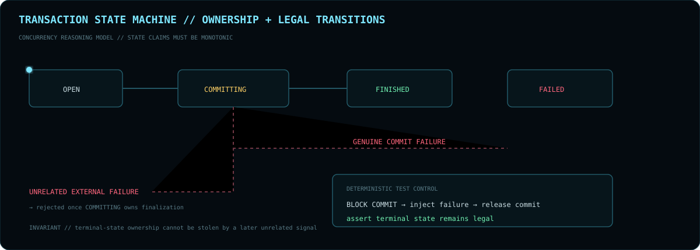

<div align="center">


<br>

**`BACKEND ARCHITECT X // DISTRIBUTED SYSTEMS ENGINEER`**

`JAVA` · `SPRING BOOT` · `PYTHON` · `FASTAPI` · `FLASK` · `KAFKA` · `NETTY` · `NODE.JS` · `TYPESCRIPT` · `JAVASCRIPT` · `SQL` · `REDIS` · `KUBERNETES` · `AWS`

[GitHub](https://github.com/BackendArchitectX) · [Email](mailto:pranayp.kadu@gmail.com)

<sub>Concurrency · correctness · failure recovery · resource lifecycle · performance · operability</sub>

</div>

---

## `00 // OPERATOR PROFILE`

```text
OPERATOR      Pranay Kadu / BackendArchitectX
ROLE          Backend & Distributed Systems Engineer
PRIMARY       Java / JVM / Spring Boot
PYTHON        Python 3 / FastAPI / Flask
WEB           TypeScript / JavaScript / Node.js / Express.js / ReactJS
SYSTEMS       Kafka / Netty / gRPC / transactions / streaming
NATIVE        C++ / STL
DATA          MySQL / PostgreSQL / MongoDB / Redis / SQL
RUNTIME       Docker / Kubernetes / AWS / EKS / PCF / CI-CD
OBSERVABILITY CloudWatch / Splunk / Dynatrace
METHOD        invariants / ownership / deterministic tests / observable failure boundaries
```

> I am most interested in backend problems where correctness depends on **who owns state, which endpoint is real, which resource must be released, and which transition is still legal after failure begins**.


### `SYSTEM DESIGN LENS`

```text
INGRESS      → validate identity / authorization / rate limits
COMPUTE      → keep state ownership explicit
STATE        → distinguish hot-path cache from durable truth
STREAMING    → make delivery / retry / idempotency semantics visible
REMOTE RPC   → define timeout / fallback / circuit-breaker behavior
RESOURCES    → own threads / permits / connections / native handles
OBSERVATION  → logs / metrics / traces / profiling
FINALIZATION → release resources before declaring terminal state complete
PROOF        → force race windows and failure paths deterministically
```

**Operating invariant:** every asynchronous resource, state transition and remote dependency must have a clear owner and a defined failure path.

---


## `01 // TECHNICAL STACK`

### `LANGUAGES`

`Java` · `J2EE` · `Python 3` · `C++` · `TypeScript` · `JavaScript` · `SQL`

### `BACKEND + APIs`

`Spring` · `Spring Boot` · `Spring MVC` · `FastAPI` · `Flask` · `Node.js` · `Express.js` · `REST APIs` · `JSP`

### `FRONTEND / CLIENT`

`ReactJS` · `TypeScript` · `JavaScript` · API-driven frontend integration

### `ARCHITECTURE + CONCURRENCY`

`Microservices` · `Distributed Systems` · `Event-Driven Architecture` · `Asynchronous Processing` · `Multithreading` · `Concurrency` · `Caching` · `Functional Programming` · `Parallel Processing` · `Algorithms`

### `MESSAGING + DATA`

`Apache Kafka` · `Message Queues` · `MySQL` · `PostgreSQL` · `MongoDB` · `Redis` · `SQL Query Optimization`

### `TESTING + ENGINEERING PRACTICES`

`JUnit` · `TDD` · `OOP` · `SOLID Principles` · `Agile`

### `CLOUD + DEVOPS`

`AWS` · `EKS` · `PCF` · `CloudWatch` · `Docker` · `Kubernetes` · `Jenkins` · `CI/CD`

### `TOOLS + MONITORING`

`Git` · `GitHub` · `Bitbucket` · `Jira` · `Splunk` · `Dynatrace` · `XML`

### `AI-ASSISTED ENGINEERING`

`Claude Sonnet` · `Claude Opus` · `GitHub Copilot` · `AI-Powered Coding Assistants` · `Agent-Based Tools`

> **Positioning:** Java/JVM and distributed backend engineering remain the core. Python, Node.js, TypeScript/JavaScript, ReactJS and C++/STL extend the profile into integration, automation, service development, full-stack delivery and systems experimentation rather than replacing the backend-first identity.

---


## `02 // EVIDENCE POLICY`

This profile deliberately separates four levels of proof:

```text
LEVEL 04  EXTERNAL VALIDATION   → maintainer-reviewed and merged upstream
LEVEL 03  UPSTREAM REVIEW       → submitted with focused implementation and tests
LEVEL 02  REPRODUCIBLE PROOF    → benchmarks / deterministic regression / test harnesses
LEVEL 01  DESIGN INTENT         → architecture / invariants / implementation direction
```

**Rule:** presentation must never outrun validation. A merged upstream fix is stronger evidence than an open PR; a reproducible benchmark is stronger evidence than a polished architecture diagram.

---


## `03 // PRIMARY ENGINEERING SIGNALS`

### `AUTOMQ #3493 // EXTERNALLY VALIDATED`

[**controller-only AutoBalancer reporter fix →**](https://github.com/AutoMQ/automq/pull/3493)

```text
PROBLEM     Broker-only reporter logic initialized on controller-only nodes
INVARIANT   Reporter lifecycle must respect Kafka process-role semantics
CHANGE      Guard reporter initialization for controller-only processes
DETAIL      Reuse Kafka ConfigDef LIST parsing for real role inputs
PROOF       Focused process-role and lifecycle regression tests
STATUS      Maintainer feedback incorporated → revised → approved → merged
```


**Why this signal matters:** the implementation survived external design feedback. The final version became simpler, reused Kafka's own parsing semantics, retained lifecycle coverage and was then approved upstream.

### `TRINO #30973 // FINALIZATION OWNERSHIP`

[**Prevent query failure after transaction commit starts →**](https://github.com/trinodb/trino/pull/30973)



```text
PROBLEM     External failure could race with autocommit finalization
INVARIANT   Once COMMITTING owns finalization, unrelated failure cannot steal it
MODEL       OPEN → COMMITTING → FINISHED
            OPEN → COMMITTING → FAILED   only for genuine commit failure
MECHANISM   Atomic finalization-state ownership
PROOF       Blocking transaction manager creates deterministic race windows
STATUS      Open / under review
```

The important part is not adding another boolean. It is modeling **who is allowed to own terminal-state transition** and proving that ownership under forced timing rather than probabilistic stress.

### `FLUSS #4263 // CONNECTION IDENTITY`

[**Handle endpoint changes for cached server connections →**](https://github.com/apache/fluss/pull/4263)

```text
PROBLEM     Stable logical UID could reuse a stale physical endpoint
INVARIANT   Logical server identity is not the same as physical connection identity
CHANGE      Connection key: UID → UID + host + port
PROOF       Two live Netty servers using the same UID and different endpoints
STATUS      Open / under review
RISK        Maintainers may prefer stronger endpoint replacement / eviction semantics
```


### `OTHER OPEN REVIEW CHANNELS`

| SYSTEM | CHANGE | ENGINEERING BOUNDARY | CURRENT PROOF |
|:--|:--|:--|:--|
| `AUTOMQ` | [#3579](https://github.com/AutoMQ/automq/pull/3579) | Prometheus authentication · credential validation · endpoint lifecycle | config / endpoint / lifecycle tests |
| `FLUSS` | [#4230](https://github.com/apache/fluss/pull/4230) | Paimon metadata mapping · Spark lake reads · predicate pushdown | lake-only + lake/log test suites |

---

## `04 // FAILURE MODEL`


```text
REQUEST
  ↓
VALIDATE / AUTH / RATE LIMIT
  ↓
CLAIM OWNERSHIP
  ↓
REMOTE / STORAGE / STREAMING WORK
  ↓
PARTIAL FAILURE?
  ├─ no  → FINALIZE → EMIT / PERSIST TERMINAL STATE
  └─ yes → CONTAIN / RETRY / FALLBACK / ABORT
                 ↓
        RELEASE OWNED RESOURCES
                 ↓
       PRESERVE LEGAL STATE TRANSITIONS
                 ↓
       DETERMINISTIC REGRESSION PROOF
```

### `FAILURE CLASSES`

| CLASS | FAILURE SHAPE | INVARIANT | RESPONSE |
|:--|:--|:--|:--|
| `CONCURRENCY` | commit vs failure · cancellation · duplicate completion | only one path owns terminal transition | atomic ownership · monotonic transitions · controlled race tests |
| `RPC` | stale endpoint reuse · retained timeouts · reconnect ambiguity | physical route identity must be current | endpoint-aware identity · disconnect semantics · timeout cleanup |
| `LIFECYCLE` | event-loop leaks · scheduler survival · callbacks after close | creator owns shutdown unless ownership is transferred | idempotent close · permit/thread/connection release verification |
| `CONFIGURATION` | role mismatch · unsafe defaults · inconsistent parsing | semantics must match the source system | reuse source-of-truth parser · validate early · preserve compatibility |
| `METADATA` | logical/physical divergence · stale mapping | logical identity cannot silently imply physical location | isolate mapping layer · explicit resolution |
| `PERFORMANCE` | allocation pressure · N+1 · cache misses · sync bottlenecks | optimization must be measurable | profile · benchmark · batch · cache · bound concurrency |

---

## `05 // SYSTEMS LAB`

### `VORTEX // GPU VECTOR ENGINE`

[**Vortex CUDA →**](https://github.com/BackendArchitectX/Vortex-CUDA)


```text
REQUEST → SPRING BOOT → JAVA API → JNI HANDLE → PINNED HOST MEMORY
        → CUDA STREAMS → GPU-RESIDENT INDEX → FUSED TOP-K → RESULT
```

**Systems explored:** persistent GPU indexes · exact squared-L2 search · hierarchical/fused Top-K · FP16 storage with FP32 accumulation · vectorized memory access · FMA · pinned host memory · dual CUDA streams · JNI opaque-handle ownership · health/metrics/capacity guards.

**Lifecycle boundary:** Java `AutoCloseable` owns the native handle lifecycle; native ownership must eventually release GPU-resident state. The project therefore exercises correctness at the Java/native/device boundary, not only kernel speed.

**Documented benchmark signal:** RTX 3050 6GB Laptop GPU · 500K×128 workload · FP32 P50 ~**1.67–1.72 ms** · ~**1,641–1,662 QPS** at batch 32 · **50%** vector-storage reduction with FP16 · **99.6875% Recall@10** on the specified FP16 workload.

**Benchmark discipline:** latency, throughput, recall, storage and repeatability are treated as separate dimensions. The scalar CPU reference is explicitly not presented as an optimized production vector database.

### `DISTRIB-TXN-DB // DISTRIBUTED STATE LAB`

[**distrib-txn-db →**](https://github.com/BackendArchitectX/distrib-txn-db)

```text
PHYSICAL TIME
   ↓
HLC
   ↓
MVCC VISIBILITY
   ↓
DISTRIBUTED ROUTING
   ↓
TXN RECORDS
   ↓
WRITE INTENTS
   ↓
SNAPSHOT ISOLATION
   ↓
CLOCK UNCERTAINTY
   ↓
READ RESTART
   ↓
SERIALIZABLE CONFLICT PREVENTION
```

**What the project is for:** understanding why each mechanism exists by first exposing the anomaly that appears without it.

```text
ANOMALY        → MECHANISM
stale version  → MVCC visibility rules
partial txn    → transaction records + intents
write conflict → isolation / conflict handling
clock skew     → uncertainty window
unsafe read    → read restart
serialization  → conflict prevention
```

`EDUCATIONAL SYSTEMS MODEL // NOT PRESENTED AS PRODUCTION-COMPLETE INFRASTRUCTURE`

---


## `06 // ENGINEERING MATRIX`

```text
LANGUAGES / WEB            BACKEND / APIs             DISTRIBUTED SYSTEMS        PERFORMANCE
────────────────────       ─────────────────────      ─────────────────────      ───────────────────
Java / J2EE                Spring / Spring Boot       Kafka / streaming          JFR / profiling
Python 3                   Spring MVC                 Transactions               Concurrency
C++ / STL                  FastAPI / Flask            Consistency                Resource lifecycle
TypeScript / JavaScript    Node.js / Express.js       Failure recovery           Async execution
ReactJS                    REST APIs / JSP            Idempotency                 Parallel processing
SQL                        JPA / Hibernate            Rate limiting               Query tuning

DATA / MESSAGING           CLOUD / DEVOPS             QUALITY / PRACTICES        OPERABILITY
────────────────────       ─────────────────────      ─────────────────────      ───────────────────
MySQL / PostgreSQL         AWS / EKS                  JUnit / TDD                CloudWatch
MongoDB / Redis            Docker / Kubernetes        OOP / SOLID                Splunk / Dynatrace
Kafka / Message Queues     PCF / Jenkins              Agile                      Git / GitHub
SQL optimization           CI/CD                      Algorithms                 Bitbucket / Jira
Caching                    Cloud deployment           Functional programming     Production support
```

### `ENGINEERING PRINCIPLES`

```text
01  CORRECTNESS BEFORE CLEVERNESS
02  MAKE FAILURE STATES EXPLICIT
03  MODEL OWNERSHIP BEFORE WRITING RECOVERY LOGIC
04  SEPARATE LOGICAL IDENTITY FROM PHYSICAL LOCATION
05  ASSUME CALLBACKS CAN ARRIVE AFTER CLOSE
06  OWN THREADS / PERMITS / CONNECTIONS / NATIVE HANDLES YOU CREATE
07  DESIGN RETRIES AROUND IDEMPOTENCY AND BOUNDED FAILURE
08  TEST RACES BY CONTROLLING TIME — NOT BY HOPING TO HIT THEM
09  MEASURE PERFORMANCE BEFORE AND AFTER OPTIMIZATION
10  TREAT OPERABILITY AS PART OF THE SYSTEM DESIGN
11  PREFER SOURCE-OF-TRUTH PARSING OVER PARALLEL SEMANTICS
12  DISTINGUISH EXTERNAL VALIDATION FROM WORK STILL UNDER REVIEW
```

---

## `07 // OPERATING MODEL`

```text
OBSERVE
  └─ logs / metrics / traces / profiling
       ↓
ISOLATE
  └─ smallest resource, ownership or state boundary
       ↓
MODEL
  └─ invariants / legal transitions / failure semantics
       ↓
CHANGE
  └─ smallest production-safe correction
       ↓
PROVE
  └─ unit / integration / deterministic regression
       ↓
MEASURE
  └─ latency / throughput / resource behavior
       ↓
OPERATE
  └─ alerts / dashboards / runbooks / rollback awareness
```

### `WHAT I OPTIMIZE FOR`

| DIMENSION | QUESTION |
|:--|:--|
| `CORRECTNESS` | Can two actors believe they own the same state transition? |
| `FAILURE` | What happens after the happy path has partially completed? |
| `LIFECYCLE` | Who shuts down the resource and what if close races with callback completion? |
| `IDENTITY` | Is the identifier logical, physical, cached or authoritative? |
| `PERFORMANCE` | What measurement proves the optimization actually helped? |
| `OPERABILITY` | How will the failure be detected, diagnosed and recovered in production? |

> **Engineering policy:** correctness before cleverness. Make failure states explicit. Test races deterministically. Own resource lifecycle.

---


## `08 // CURRENT VECTOR`

<div align="center">

**`DISTRIBUTED SYSTEMS · STORAGE · STREAMING · CONCURRENCY · RELIABILITY · PERFORMANCE`**

<sub>Races · failure boundaries · endpoint identity · resource ownership · state transitions · recovery semantics</sub>

<br><br>


<br>


</div>
