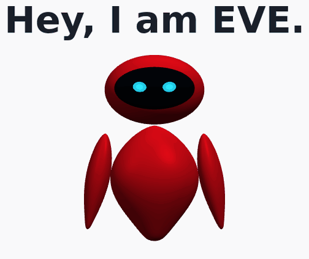

<!-- GitHub profile · BackendArchitectX -->

<!-- Native profile identity beside independent red EVE animation -->
<picture>
  <source media="(prefers-reduced-motion: reduce) and (prefers-color-scheme: dark)" srcset="./assets/eve-robot-v20-multilingual-red-dark-still.png" />
  <source media="(prefers-reduced-motion: reduce)" srcset="./assets/eve-robot-v20-multilingual-red-light-still.png" />
  <source media="(prefers-color-scheme: dark)" srcset="./assets/eve-robot-v20-multilingual-red-dark.gif" />
  
</picture>

  <ul align="left">
    
<picture><source media="(prefers-color-scheme: dark)" srcset="./assets/readme-name-48-dark.svg" /></picture>

    
<picture><source media="(prefers-color-scheme: dark)" srcset="./assets/readme-header-role-30-dark.svg" /></picture>

    
<picture><source media="(prefers-color-scheme: dark)" srcset="./assets/readme-header-stack-24-dark.svg" /></picture>

  </ul>

 

<strong>PROJECTS · SKILLS · CONTRIBUTIONS</strong>

  
  
  
  

I build and maintain reliable backend systems with a focus on **transaction correctness, concurrency, performance and fault recovery**. My experience covers production microservices, event-driven architectures, cloud infrastructure and open-source engineering.

<picture><source media="(prefers-color-scheme: dark)" srcset="./assets/readme-text-crimson-titanium-summary-dark.svg" /></picture>

---

<h2 id="open-source-engineering"><picture><source media="(prefers-color-scheme: dark)" srcset="./assets/readme-text-crimson-titanium-open-source-engineering-dark.svg" /></picture></h2>

I contribute to distributed infrastructure with an emphasis on correctness, concurrency and reliability.

### Merged Engineering Contributions

- **[Kestra AWS Plugin #889](https://github.com/kestra-io/plugin-aws/pull/889)** — Preserved DynamoDB binary attributes on reads with regression tests.
- **[Apache Pinot #19915](https://github.com/apache/pinot/pull/19915)** — Reduced hash collisions and unnecessary key allocations in replica-group instance lookups using a custom hash strategy.
- **[Apache Fluss #4263](https://github.com/apache/fluss/pull/4263)** — Fixed stale RPC connections with endpoint-aware caching and regression tests.
- **[Apache Pulsar #26969](https://github.com/apache/pulsar/pull/26969)** — Improved topic watcher notification dispatch through namespace-based indexing and concurrency tests.
- **[Apache Druid #20633](https://github.com/apache/druid/pull/20633)** — Preserved structured user-error classifications during distributed query execution.
- **[AutoMQ #3555](https://github.com/AutoMQ/automq/pull/3555)** — Fixed asynchronous readahead races after reader closure.
- **[AutoMQ #3493](https://github.com/AutoMQ/automq/pull/3493)** — Prevented broker-specific metrics initialization on controller-only nodes.
- **[AutoMQ #3542](https://github.com/AutoMQ/automq/pull/3542)** — Removed redundant topic cleanup notifications.

[View merged external engineering pull requests](https://github.com/pulls?q=is%3Apr+is%3Amerged+author%3ABackendArchitectX+-user%3ABackendArchitectX+-repo%3Ais-a-dev%2Fregister)

---

<h2 id="professional-experience"><picture><source media="(prefers-color-scheme: dark)" srcset="./assets/readme-text-crimson-titanium-professional-experience-dark.svg" /></picture></h2>

**Software Engineer | Linux Socials**  
*Apr 2025 – Present*

- Develop fraud-screening services using Spring Boot, Redis, idempotent APIs, rate limiting and fault-tolerance patterns.
- Improve service performance, production observability and incident recovery.

**Associate Software Engineer | Merkle Inspire**  
*Dec 2021 – Apr 2024*

- Developed financial transaction workflows using Spring MVC, JPA/Hibernate, transaction isolation, optimistic locking and SQL optimization.
- Built API integrations with concurrent processing, bounded retries, batch persistence and caching.

---

<h2 id="selected-projects"><picture><source media="(prefers-color-scheme: dark)" srcset="./assets/readme-text-crimson-titanium-selected-projects-dark.svg" /></picture></h2>

- **[NUMEN](https://github.com/BackendArchitectX/NUMEN)** — Java-based data intelligence with auditability, provenance tracking and validation.
- **[Aegis Insurance Decisioning](https://github.com/BackendArchitectX/Aegis-Insurance-Decision-Platform)** — Insurance risk simulation using Spring Boot, Angular and auditable decision workflows.
- **[Vortex CUDA](https://github.com/BackendArchitectX/Vortex-CUDA)** — GPU-accelerated vector search using CUDA, C++20 and Java JNI with benchmark validation.

---

<h2 id="technical-expertise"><picture><source media="(prefers-color-scheme: dark)" srcset="./assets/readme-text-crimson-titanium-technical-expertise-dark.svg" /></picture></h2>

| Area | Technologies |
| --- | --- |
| **Languages** | Java 8/17, Python, C++, JavaScript, TypeScript |
| **Backend** | Spring Boot, Spring MVC, REST APIs, JPA/Hibernate, FastAPI, Flask |
| **Distributed Systems** | Kafka, Redis, concurrency, idempotency, caching, resilience patterns |
| **Cloud & DevOps** | AWS, Docker, Kubernetes, Jenkins, CI/CD |
| **Databases** | PostgreSQL, MySQL, Oracle SQL, query optimization |
| **Observability & Testing** | Splunk, Grafana, JUnit, Mockito, integration testing |

---

<h2 id="engineering-principles"><picture><source media="(prefers-color-scheme: dark)" srcset="./assets/readme-text-crimson-titanium-engineering-principles-dark.svg" /></picture></h2>

**Design for failure. Measure before optimizing. Preserve correctness.**

I prioritize clear architecture, reproducible tests and systems that remain reliable under real-world operating conditions.

I favor focused, reviewable patches backed by regression tests and explicit failure-mode analysis.

**Open to backend engineering opportunities and meaningful open-source collaboration.**
